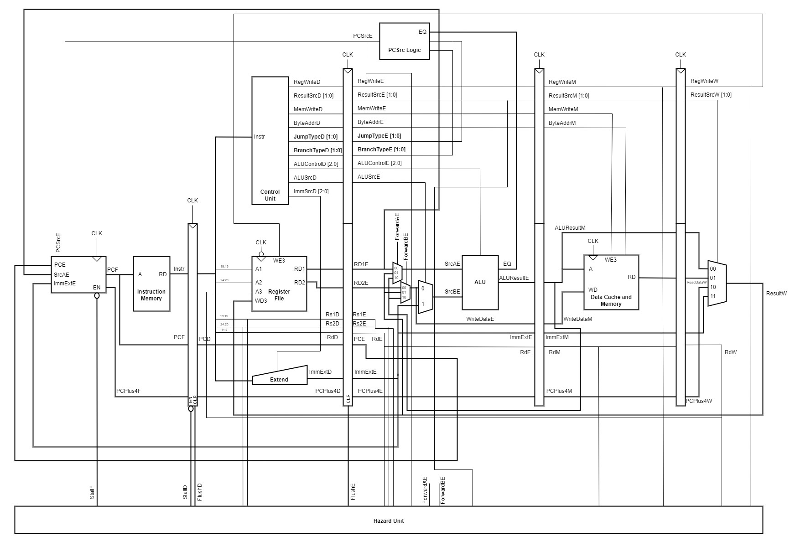

# Team-3-RISCV-RV32I_Processor_Project

## Contents:
1. [Joint Statement](#joint-statement)  
2. [Contributors and Personal Statements](#contributors-and-personal-statements)  
3. [Source Code](#source-code)  
4. [High Level Description](#high-level-description)  
5. [Repository Structure](#repository-structure)  
6. [Combined File Listing](#combined-file-listing)  
7. [References](#references)  

## Joint Statement
>TODO: Insert Joint Statement Here

## Contributors and Personal Statements

| Name           | CID      | GitHub Username    | Email           | Personal Statement |
|----------------|----------|--------------------|-----------------|----------------------------|
| Steve Nimo     | 02254814 | **Nimosteve88**    | sn722@ic.ac.uk  | [Statement](statements/Steve.md)                  |
| Sne Samal      | 02201807 | **sne-samal**      | ss5322@ic.ac.uk | [Statement](statements/Sne.md)                  |
| Divine Wodi    | 02208866 | **CB-WO3**         | dw722@ic.ac.uk  |                            |
| Yannis Zioulis | 02223077 | **yanniszioulis** | yz9722@ic.ac.uk | [Statement](statements/Yannis.md)                  |

## Source Code
In the table below, you can directly access the source code for the different processor versions. You can click on a link to the test results for each version. This link contains video evidence of the processor working and instructions to access relevant waveforms. If you want to test the code for yourself, click on the test instructions link, where you will be directed to instructions on how to test the processor with both the reference and f1 programs.

You can also view all our test instructions and results in the `test` folder under [test instructions (all versions)] and [test results (all versions)] respectively.   

| Processor Version         | Test Instructions | Test Results |
|---------------------------|--------------|----------------------|
| [Single Cycle](https://github.com/Nimosteve88/Team-3-RISCV-RV32I_Processor_Project/tree/main/rtl/single_cycle#readme)              | [Single Cycle Test Instructions](https://github.com/Nimosteve88/Team-3-RISCV-RV32I_Processor_Project/tree/main/rtl/single_cycle#testing-instructions)             |  [Single Cycle Test Results](https://github.com/Nimosteve88/Team-3-RISCV-RV32I_Processor_Project/tree/main/rtl/single_cycle#test-results)                    |
| [Pipelined](https://github.com/Nimosteve88/Team-3-RISCV-RV32I_Processor_Project/blob/main/rtl/pipelined/README.md)                 | [Pipelined Test Instructions](https://github.com/Nimosteve88/Team-3-RISCV-RV32I_Processor_Project/blob/main/rtl/pipelined/README.md#testing-instructions)             |  [Pipelined Test Results](https://github.com/Nimosteve88/Team-3-RISCV-RV32I_Processor_Project/blob/main/rtl/pipelined/README.md#test-results)                    |
| [Pipelined with Data Cache](https://github.com/Nimosteve88/Team-3-RISCV-RV32I_Processor_Project/blob/main/rtl/cache/README.md) |  [Pipelined with Data Cache Test Instructions](https://github.com/Nimosteve88/Team-3-RISCV-RV32I_Processor_Project/blob/main/rtl/cache/README.md#testing-instructions)            | [Pipelined with Data Cache Test Results](https://github.com/Nimosteve88/Team-3-RISCV-RV32I_Processor_Project/blob/main/rtl/cache/README.md#test-results)                     |

## High Level Description
> TODO: Insert high level description of what were tasked to do in each stretch goal

#### Single Cycle Processor:

#### Pipelined Processor:

#### Pipelined Processor with Data Cache:

## Repository Structure
> TODO: Insert a tree diagram of the structure of this repository so that the marker has a broad overview of files and where they are located. Also include a list of important files and folders and explain their purpose - don't want the marker to figure it out on their own.

## Combined File Listing
This is the file listing for all the files that were used in each processor version. The listing has the file name and the version in which they were first used alongside the relevant contributors.

Key: `x`: full responsibility; `p`: partial responsibility; `t`: testing

| File Name                                                         | First Seen          | Steve | Sne | Divine | Yannis |
|-------------------------------------------------------------------|---------------------|-------|-----|--------|--------|
| alu.sv                                                            | Single Cycle        |   x    | t   |       |       |
| alu_src_mux.sv                                                    | Single Cycle        |   x    |     |       |       |
| control_unit.sv                                                   | Single Cycle        |       | t   |        |        |
| data_memory.sv                                                    | Single Cycle        |       | x   |        |        |
| data_top_level.sv                                                 | Single Cycle        |   x   | t   |        |        |
| extend.sv                                                         | Single Cycle        |       | p   |        |        |
| instruction_memory.sv                                             | Single Cycle        |       |     |        |        |
| pc_module.sv                                                      | Single Cycle        |       | t   |        | x      |
| pc_reg.sv                                                         | Single Cycle        |       |     |        | x      |
| register_file.sv                                                  | Single Cycle        |   x   | t   |        |        |
| result_mux.sv                                                     | Single Cycle        |       | x   |        |        |
| toplevel.sv (single cycle)                                        | Single Cycle        |       | x/t |        |        |
| F1.s                                                              | Single Cycle        |       |     |        | x      |
| control_unit_pipelined.sv                                         | Pipelined           |       | t   |        |        |
| decode.sv                                                         | Pipelined           |    p   | t   |        | x      |
| execute.sv                                                        | Pipelined           |   p    | t   |        | x      |
| fetch.sv                                                          | Pipelined           |    p   | t   |        | x      |
| hazard.sv                                                         | Pipelined           |       | t   |        | x      |
| memory.sv                                                         | Pipelined           |    p   | t   |        | x      |
| pc_reg.sv                                                         | Pipelined           |   p    |     |        |        |
| PCSrclogic.sv                                                     | Pipelined           |       | t   |        |        |
| rd1emux.sv                                                        | Pipelined           |    x   |     |        |        |
| rd2emux.sv                                                        | Pipelined           |    x  |     |        |        |
| top_level.sv (pipelined)                                          | Pipelined           |       | x/t |        |        |
| write_back.sv                                                     | Pipelined           |    p   | t   |        | x      |
| cache.sv                                                          | Pipelined and Cache |       |     |        | x      |
| combined_cache_memory.sv                                          | Pipelined and Cache |       | x/t |        |        |
| data_memory.sv (updated for data cache)                           | Pipelined and Cache |       | x/t |        |        |
| rd_mux.sv                                                         | Pipelined and Cache |       | x   |        |        |
| top_level.sv (pipelined and cache)                                | Pipelined and Cache |       | x/t |        |        |
## References
Our CPU was an extension of the processor outlined in Prof. Peter Cheung's lecture notes and in the textbook: _"Digital Design and Computer Architecture (RISC-V Edition)"_ by Sarah Harris and David Harris. 
