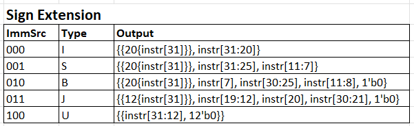

# Personal Statement: Sne Samal
**CID:** 02201807
**GitHub Username:** sne-samal

## Quick Links
- [Contributions](#contributions)
- [Reflection](#reflection)
- [Mistakes](#mistakes)
- [Special design decisions](#special-design-decisions)
- [Given more time](#given-more-time)

## Contributions
### Sign Extend
- Updated sign extend to output correct sign extended immediates for I, S, B, J, and U type instructions.
- As per this specification:

- **Commit:** [4008b9c](https://github.com/Nimosteve88/Team-3-RISCV-RV32I_Processor_Project/commit/4008b9cfe27fa0b299804222230f8b3731e6cacc)

### Data Memory
- Specified System Verilog for data memory. 
- Implemented as RAM, inline with the memory map given in the project brief.
- Added byte reading and storing for `LBU` and `SB` instructions.
- **Commit:** 

### Top Level
- Designed the top level file for the single cycle having communicated with other team members
- Diagram of single cycle top level:
- **Commit:**

### Testing and Debugging
- Wrote comprehensive test benches for updated components.
- Printed test outputs directly to the terminal. I found this to be a better way of testing rather than loading the waveform onto GTK wave and manually checking values.
- Wrote the top level test bench for the reference and F1 programs.
- Testing was conducted on the following files:

| **Component** | **Test Bench File** |
|---------------|---------------------|
| ALU           |                     |
| Control Unit  |                     |
| Sign Extend   |                     |
| PC Module     |                     |
| Top Level CPU |                     |

## Reflection

## Mistakes

## Special design decisions
### Byte Addressing in Data Memory
- Specified an extra input bit from the control unit to the data memory to tell the data memory to read/store the LSB of an address/value. Not sure if this is standard though.

### Automation of Test Results
- Rather than viewing the waveform for certain test benches, I wrote functions that would verify that the output is as what I expected. 
- This way, I can run multiple test cases quickly by plugging in multiple inputs one after the other and printing out whether the output is correct or not.
- This was much quicker than viewing waveforms and more efficient in my opinion.

## Given more time

