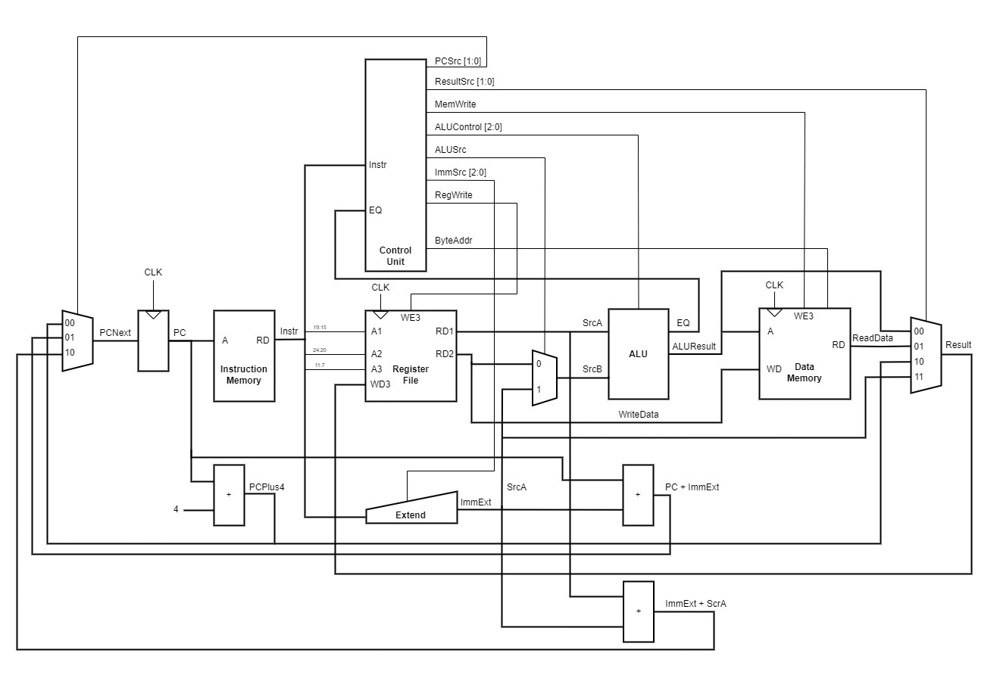
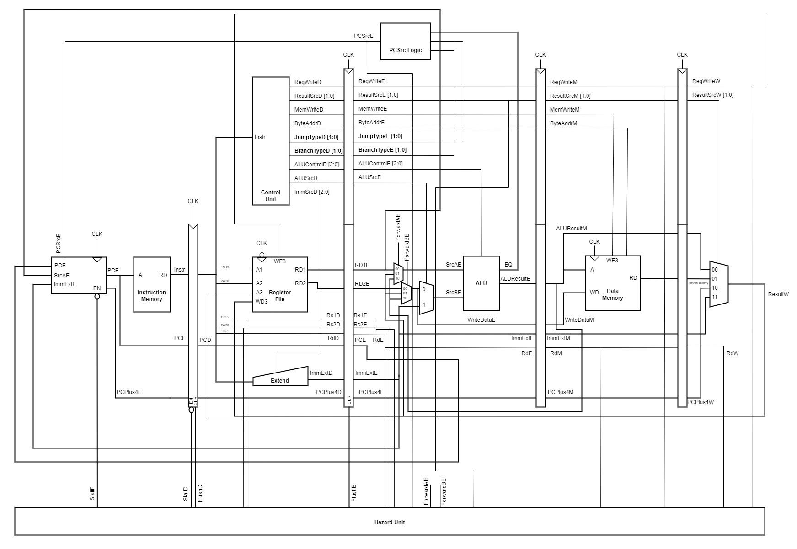
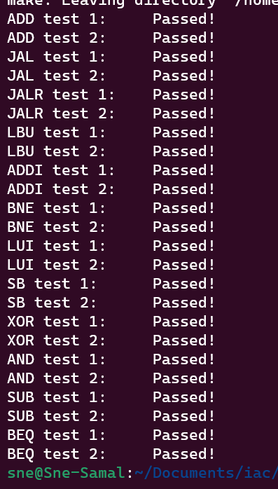
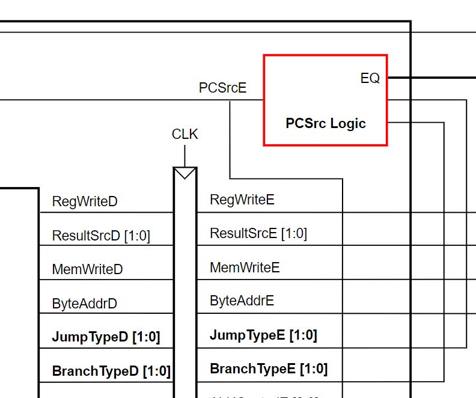

# Personal Statement: Sne Samal
**CID:** 02201807
**GitHub Username:** sne-samal

## Quick Links
- [Contributions](#contributions)
- [Reflection](#reflection)
- [Mistakes](#mistakes)
- [Special design decisions](#special-design-decisions)
- [Given more time](#given-more-time)

## Contributions
#### Single Cycle: Sign Extend: [4008b9c](https://github.com/Nimosteve88/Team-3-RISCV-RV32I_Processor_Project/commit/4008b9cfe27fa0b299804222230f8b3731e6cacc)
- Updated sign extend to output correct sign extended immediates for I, S, B, J, and U type instructions.
- As per this specification:

#### Single Cycle: Data Memory: [5779d53](https://github.com/Nimosteve88/Team-3-RISCV-RV32I_Processor_Project/commit/5779d53e960b9f482223b6e8bc150dd2bf41c961)
- Specified System Verilog for data memory. 
- Implemented as RAM, inline with the memory map given in the project brief.
- Added byte reading and storing for `LBU` and `SB` instructions.

#### Single Cycle: Top Level: [b7647d6](https://github.com/Nimosteve88/Team-3-RISCV-RV32I_Processor_Project/commit/b7647d64a8db94cae6d9b5744ef8fe47a9a4b4aa)
- Designed the top level file for the single cycle having communicated with other team members
- Diagram of single cycle top level:

#### Single Cycle: Testing and Debugging:
- Wrote comprehensive test benches for updated components.
- Printed test outputs directly to the terminal. I found this to be a better way of testing rather than loading the waveform onto GTK wave and manually checking values.
- Wrote the top level test bench for the reference and F1 programs.
- Testing was conducted on the following files:

| **Component** | **Test Bench File** |
|---------------|---------------------|
| ALU           | [alu_tb.cpp](https://github.com/Nimosteve88/Team-3-RISCV-RV32I_Processor_Project/blob/main/rtl/single_cycle/tests/alu_tb.cpp)                    |
| Control Unit  | [control_unit_tb.cpp](https://github.com/Nimosteve88/Team-3-RISCV-RV32I_Processor_Project/blob/main/rtl/single_cycle/tests/control_unit_tb.cpp)                    |
| Sign Extend   | [extend_tb.cpp](https://github.com/Nimosteve88/Team-3-RISCV-RV32I_Processor_Project/blob/main/rtl/single_cycle/tests/extend_tb.cpp)                    |
| PC Module     | [pc_module_tb.cpp](https://github.com/Nimosteve88/Team-3-RISCV-RV32I_Processor_Project/blob/main/rtl/single_cycle/tests/pc_module_tb.cpp)                    |
| Top Level CPU | [toplevel_tb.cpp](https://github.com/Nimosteve88/Team-3-RISCV-RV32I_Processor_Project/blob/main/rtl/single_cycle/toplevel_tb.cpp)                    |

#### Pipelining: Top Level: [1275e68](https://github.com/Nimosteve88/Team-3-RISCV-RV32I_Processor_Project/commit/1275e68ab0f799c9920300c993d8b91525329b3f)
- Designed the new top level overview for the pipelined processor with new pipeline registers, a hazard unit and the a new logic unit that determined PCSrc.
- Wrote System Verilog for the top level module.

#### Pipelined: Testing:
- Wrote test benches for new parts specific for the pipelined processor:

| **Component**                      | **Test Bench File**                                                                                                                                              |
|------------------------------------|------------------------------------------------------------------------------------------------------------------------------------------------------------------|
| Control Unit Pipelined             | [control_unit_pipelined_tb.cpp](https://github.com/Nimosteve88/Team-3-RISCV-RV32I_Processor_Project/blob/main/rtl/pipelined/tests/control_unit_pipelined_tb.cpp) |
| Decode pipeline register           | [decode_tb.cpp](https://github.com/Nimosteve88/Team-3-RISCV-RV32I_Processor_Project/blob/main/rtl/pipelined/tests/decode_tb.cpp)                                 |
| Execute pipeline register          | [execute_tb.cpp](https://github.com/Nimosteve88/Team-3-RISCV-RV32I_Processor_Project/blob/main/rtl/pipelined/tests/execute_tb.cpp)                               |
| Fetch register and Program counter | [fetch_tb.cpp](https://github.com/Nimosteve88/Team-3-RISCV-RV32I_Processor_Project/blob/main/rtl/pipelined/tests/fetch_tb.cpp)                                   |
| Hazard unit                        | [hazard_tb.cpp](https://github.com/Nimosteve88/Team-3-RISCV-RV32I_Processor_Project/blob/main/rtl/pipelined/tests/hazard_tb.cpp)                                 |
| Memory pipeline register           | [memory_tb.cpp](https://github.com/Nimosteve88/Team-3-RISCV-RV32I_Processor_Project/blob/main/rtl/pipelined/tests/memory_tb.cpp)                                 |
| PCSrc Logic                        | [pc_src_logic_tb.cpp](https://github.com/Nimosteve88/Team-3-RISCV-RV32I_Processor_Project/blob/main/rtl/pipelined/tests/pc_src_logic_tb.cpp)                     |
| Write back register                | [write_back_tb.cpp](https://github.com/Nimosteve88/Team-3-RISCV-RV32I_Processor_Project/blob/main/rtl/pipelined/tests/write_back_tb.cpp)                         |

#### Pipelined: Debugging: [f66f296](https://github.com/Nimosteve88/Team-3-RISCV-RV32I_Processor_Project/commit/f66f2965e86a285fa05a747ccb1f07ae63bf12be)
- Debugged the top level when nothing seemed to run.
- Found the error: The control unit didn't handle the case where the instruction is 0x0 (not a valid instruction, but the instruction input after a register flush)

## Reflection 
#### Testing and Debugging:
As the primary tester and debugger, I learnt to write effectvie test benches whils covering as many corner cases as I could. I also automated some of the test results, making use of the terminal to view my test results. In cases where I would have view and manually verify multiple signals with GTKWave, I found this tactic useful. Additionally I feel more confident looking at code written by other people and debugging it when the code failed my tests.

#### Computer Architecture:
By working on the top level and testing of some individual parts, I gained a deeper understanding into computer architecture and how processors work. I also developed an understanding of the role of each part in the processor and how it works. Through the stretch goals, I enhanced my knowledge of pipelining and the importance of caching within processors. 

#### System Verilog
Throughout this project, I have felt increasingly confident in my ability to specify digital logic with System Verilog whilst also ensuring that my code is readable and reusable.

#### GTKWave:
I feel more confident using GTKWave. When debugging the top level, I had a lot of different signals from different pipeline stages open. Utilising some of GTKwave's features like colour coding and data formatting proved to be helpful here.

#### Git, GitHub and Markdown:
I learnt several useful features of Git and GitHub that allowed me to effectively collaborate with my team members. I am now more competent in writing well formatted markdown files as well. 

## Mistakes

## Special design decisions
#### Byte Addressing in Data Memory:
- Specified an extra input bit from the control unit to the data memory to tell the data memory to read/store the LSB of an address/value. Not sure if this is standard though.

#### Automation of Test Results:
- Rather than viewing the waveform for certain test benches, I wrote functions that would verify that the output is as what I expected. 
- This way, I can run multiple test cases quickly by plugging in multiple inputs one after the other and printing out whether the output is correct or not.
- This was much quicker than viewing waveforms and more efficient in my opinion.

#### PCSrc Logic in the pipelined processor:
- Determining PCTarget for the program counter was done in the control unit in the single cycle processor. 
- In the pipelined processor, this is no longer possible since PCTarget (PCSrc) depends on the EQ flag (determined in the execute stage) and the instruction type (determined in the decode stage).
- To go around this, together with Divine, we designed a new logic block - PCSrc Logic - that determines PCSrc in the execute stage based on the type of jump or branch and th EQ flag.
- The type of branch and jump was determined from the control unit in the decode stage and the signals were pipelined to the execute stage to be fed into PCSrc Logic

## Given more time

