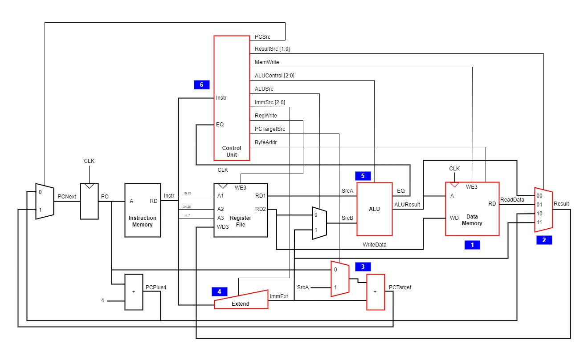
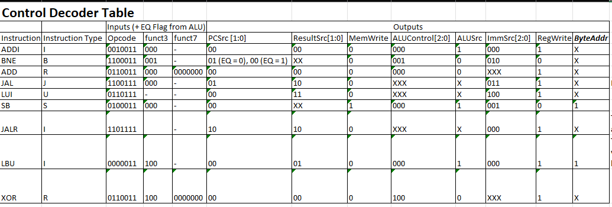
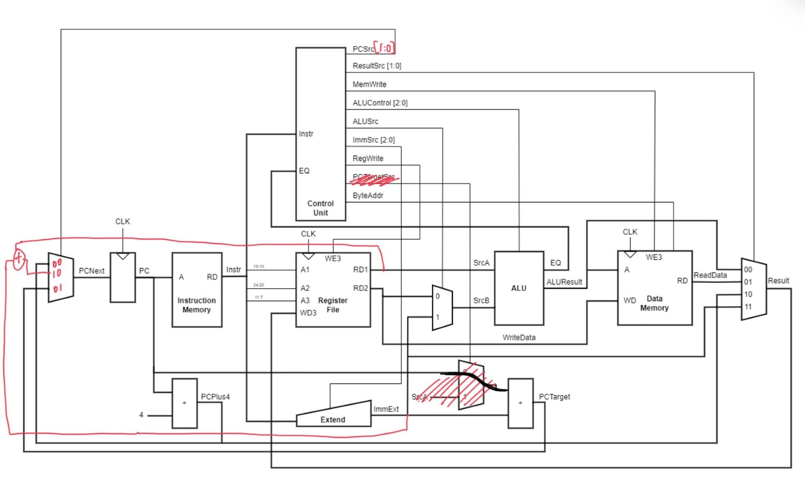

# Source Code
TODO: Add listing of who wrote each file as per specification

## Changes from Lab 4:
From looking at both the reference program and out F1 RISC-V code, there a number of changes that must be implemented to successfully execute the new instructions found in these programs. The processor needs to be updated to include the following instructions:
- ADDI (already done from lab4)
- BNE (already done from lab4)
- ADD
- JAL
- LUI
- SB
- JALR 
- LBU
- XOR

The following changes to the processor are highlighted in the diagram and further explained below:


1. **Data Memory**: Previously, we didn't have to read or store values into data memory. Now, with the introduction of `SB` and `LBU` we are both reading and writing to data memory. The data memory component must be built in accordance with the specified memory map. The WD (write data) input is always the RD2 value (value of register "rs2") since the `SB` instruction (where we are writing to the data memory) has the following format:
```
SB rs2, imm(rs1) --> the first byte of data at the address specified at (imm + rs1) = the first byte of the value at register rs2
```
The data memory has another control input apart from write enable, ByteAddr, I have added this in to specify when we want to preform a data write/store on the least significant byte (LSB) of a value at a given address (`SB`) or when we want to perform a 0 sign extension on the LSB of a value at a given address (`LBU`). Whilst this covers all cases we need from the data memory unit, it is best practice to still inlcude standard functionality of reading and writing to data memory and using a separate control bit to determine when we want to do reading and/or writing on just the least significant byte.

2. **Result MUX**: In lab4, when writing to the register file, there was only one source of input data - from the ALU. However, now there are 4 different sources of write data:
- Directly from the ALU (e.g `ADD`, `ADDI`, `XOR` instructions)
- Data output from reading from data memory (`LBU`)
- PC + 4 (Needed in the `JAL` and `JALR` instructions)
- When we want to store an immediate value (`LUI`)
To correctly choose the value we want to write to the register, we implement a mux. The select comes directly from the control unit, in accordance with the instruction type.

3. **MUX for PCTarget**: Before, for `BNE` instructions, the PCTarget would be PC + ImmExt. Now we have `JAL` and `JALR` instructions to consider. For `JAL`, we have PCTarget = PC + ImmExt (same as before), but for `JALR` we have PCTarget = rs1 + ImmExt. This is used especially in thr `RET` instruction since before jumping, we store the next PC instruction (PC+4) in a register, so when returning from a subroutine, it makes sense to set PCTarget to that value we saved before jumping. Since both cases from PCTarget have ImmExt as common, it makes sense to implement a mux to choose what to add ImmExt with to get PCTarget (PC or rs1). The select from this comes from the control unit, and its value depends on the current instruction. 
**This has been changed now PCSrc is set to b3 2 bytes long instead of 1 as before. The value of rs1 will be directly added with Imm and will be an option for the MUX related to PC, this also removes the need for the PCTargetSrc Signal - see updated diagram below**

4. **Extend**: In lab4, we only had to consider immediate sign extension for 2 type of instruction, now we need to consider 5 types. As such the input, ImmSrc has an increased width to correctly determine the sign extended immediate format based of the current instruction.

5. **ALU**: We need to do more ALU operations than lab4.

6. **Control Unit**: There are now more ouput signals based of the changes implemented above. Notably:
- ResultSrc: Dtermines what data is being written to the register file.
- MemWrite: An enable for writing or reading to data memory
- ImmSrc: Increase width than lab4 to allow for more instruction type immediate sign extension.
- PCTargetSrc: A mux select line to determine PCTarget, depending on `BNE`, `JAL` and `JALR` instruction types.
- ByteAddr: A control input to determine how we modify outputs and inputs of data memory when we only want to focus on the least significant byte.

### Control Decode Table:


### Upadted top level diagram:
