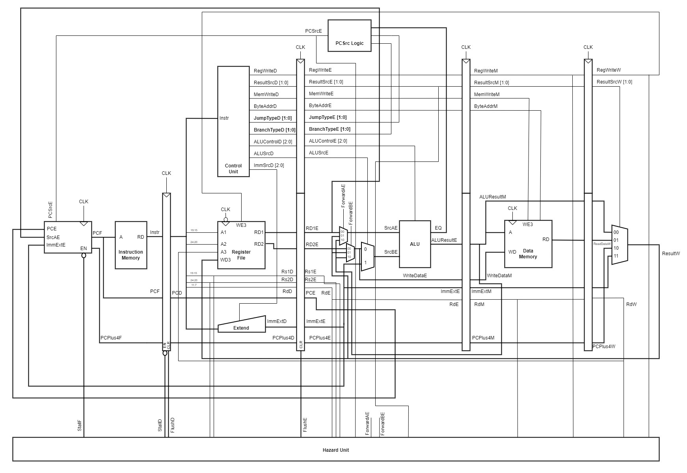
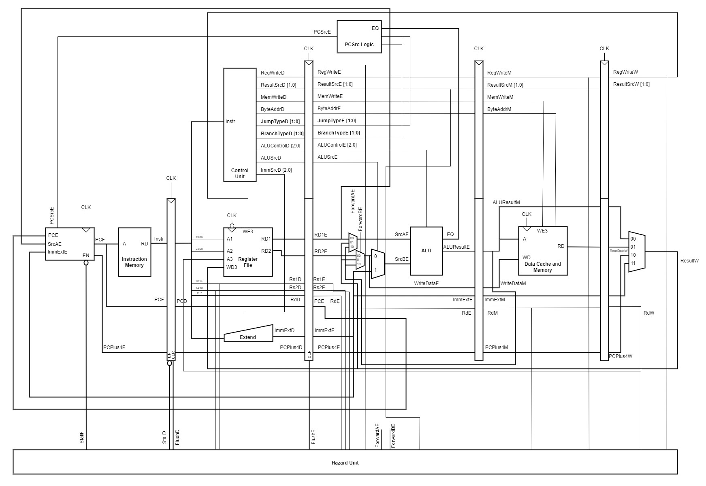

# RTL
## Contents
1. [Source Code](#source-code)
2. [High Level Description](#high-level-description)

## Source Code
In the table below, you can directly access the source code for the different processor versions.

In the README for each version, there is a file listing covering contributions, instructions to test, results of testing, detailed documentation explaining our design decisions and details of unit testing.

If you want to test the code for yourself, click on the test instructions link, where you will be directed to instructions on how to test the processor with both the reference and f1 programs.

You can click on a link to view the test results for each version. The section contains video and image evidence of our processor running the F1 and reference programs. 

You can also view all our test instructions and results in the `test` folder under [test instructions (all versions)](https://github.com/Nimosteve88/Team-3-RISCV-RV32I_Processor_Project/tree/main/test#test-instructions-all-versions) and [test results (all versions)](https://github.com/Nimosteve88/Team-3-RISCV-RV32I_Processor_Project/tree/main/test#test-results-all-versions) respectively.   

| Processor Version         | Test Instructions | Test Results |
|---------------------------|--------------|----------------------|
| [Single Cycle](https://github.com/Nimosteve88/Team-3-RISCV-RV32I_Processor_Project/tree/main/rtl/single_cycle#readme)              | [Single Cycle Test Instructions](https://github.com/Nimosteve88/Team-3-RISCV-RV32I_Processor_Project/tree/main/rtl/single_cycle#testing-instructions)             |  [Single Cycle Test Results](https://github.com/Nimosteve88/Team-3-RISCV-RV32I_Processor_Project/tree/main/rtl/single_cycle#test-results)                    |
| [Pipelined](https://github.com/Nimosteve88/Team-3-RISCV-RV32I_Processor_Project/tree/main/rtl/pipelined#readme)                 | [Pipelined Test Instructions](https://github.com/Nimosteve88/Team-3-RISCV-RV32I_Processor_Project/blob/main/rtl/pipelined/README.md#testing-instructions)             |  [Pipelined Test Results](https://github.com/Nimosteve88/Team-3-RISCV-RV32I_Processor_Project/blob/main/rtl/pipelined/README.md#test-results)                    |
| [Pipelined with Data Cache](https://github.com/Nimosteve88/Team-3-RISCV-RV32I_Processor_Project/tree/main/rtl/cache#readme) |  [Pipelined with Data Cache Test Instructions](https://github.com/Nimosteve88/Team-3-RISCV-RV32I_Processor_Project/blob/main/rtl/cache/README.md#testing-instructions)            | [Pipelined with Data Cache Test Results](https://github.com/Nimosteve88/Team-3-RISCV-RV32I_Processor_Project/blob/main/rtl/cache/README.md#test-results)                     |

## High Level Description
#### Single Cycle Processor:
- We designed a functional single cycle processor capable of processing 12 RISC-V instructions
- The processor has a functional program counter that can work out the next address of the following instruction depening on a result of a branch/ jump or not
- The single cycle processor can fetch the next instruction, decode it to get the desired control signals, execute the instruction using the specified operands and write the result to memory or registers if applicable.  

#### Pipelined Processor:
- In addition to the single cycle processor this processor implements pipelining
- This version has pipeline registers so that each stage is processing something at one time
- There is a functional hazard unit to stall and flush relevent pipeline registers in the presence of control and data hazards. 

#### Pipelined Processor with Data Cache:
- In addition to the pipelined processor, this version includes a data cache.
- The added data cache is a 1 way set associative cache with 4 sets and a block size of 4, to design for spatial locality.  
