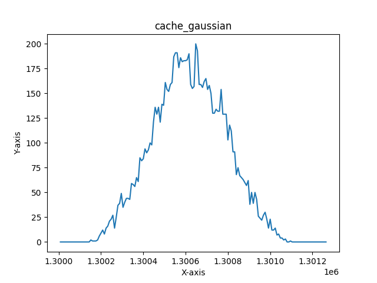
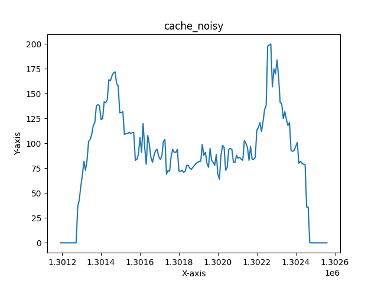
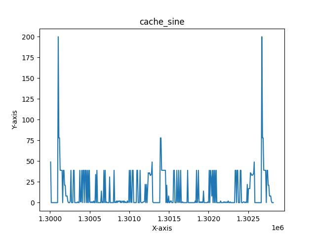
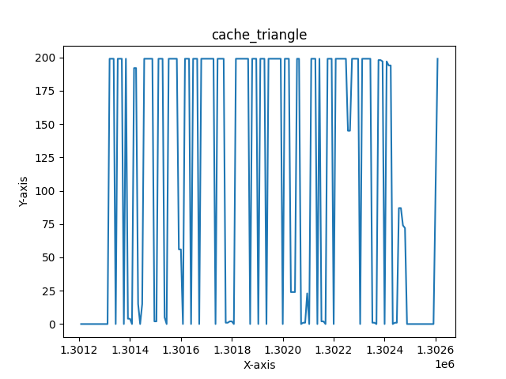
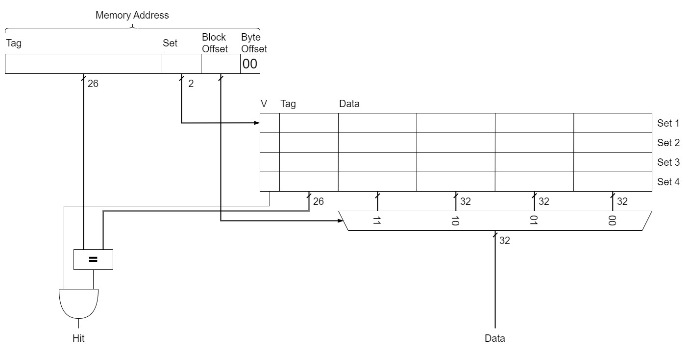
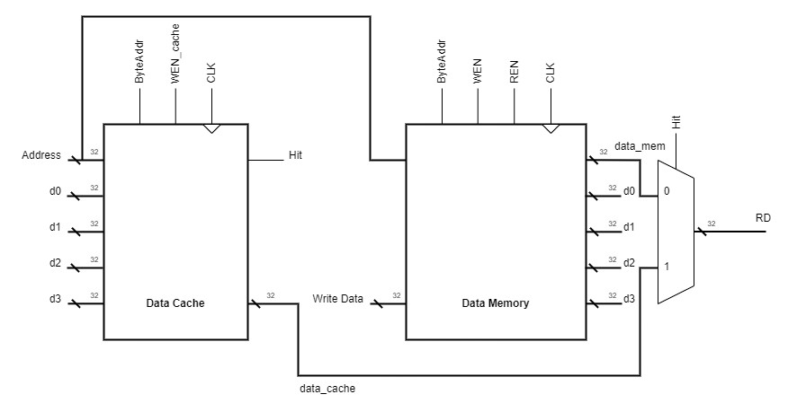
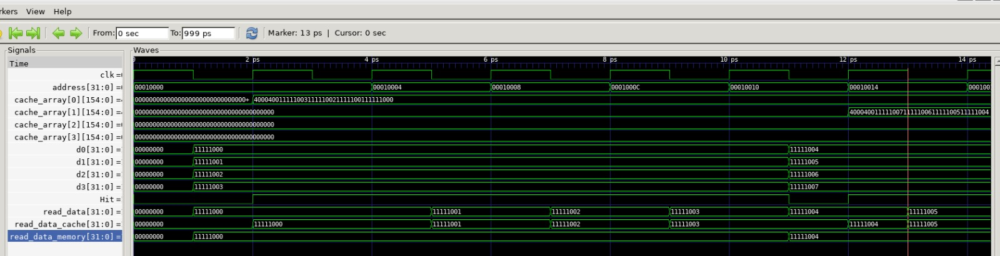

# Pipelined Processor with Data Cache.
## Contents
1. [File Listing](#file-listing)  
2. [Testing Instructions](#testing-instructions)  
3. [Test Results](#test-results)   
4. [Documentation](#documentation)  
5. [Unit Testing Documentation](#unit-testing-documentation)

## File Listing
> [!IMPORTANT]
> This file listing contains only the components that required changing for this version, components that are in the top level, but aren't listed remained the same in terms of individual functonality to that of the single cycle processor or pipelined processor. You can see the file listing for those parts on the [single cycle file listing](https://github.com/Nimosteve88/Team-3-RISCV-RV32I_Processor_Project/tree/main/rtl/single_cycle#file-listing) or [pipelined processor file listing](https://github.com/Nimosteve88/Team-3-RISCV-RV32I_Processor_Project/tree/main/rtl/pipelined#file-listing). Alternatively, you can also view a [combined file listing](https://github.com/Nimosteve88/Team-3-RISCV-RV32I_Processor_Project/tree/main?tab=readme-ov-file#combined-file-listing), with files from all goals.

Key: `x`: full responsibility; `p`: partial responsibility; `t`: testing

| File Name                | Steve | Sne | Divine | Yannis |
|--------------------------|-------|-----|--------|--------|
| cache.sv                 |       |     |        |   x    |
| combined_cache_memory.sv |       | x/t |        |        |
| data_memory.sv           |       | x/t |        |        |
| rd_mux.sv                |       | x   |        |        |
| top_level.sv             |       | x/t |        |        |

## Testing Instructions
#### Testing the Formula 1 Program
1. Set up a connection to Vbuddy.
2. `cd` into the `cache` directory
3. Open the directory in VSCode - this is to edit the code so that correct instructions are run.
4. In `instruction_memory.sv` (located in the control folder) edit line 13 to the following:
```verilog
    $readmemh("f1.mem", instr_array);
```

5. In `data_memory.sv` (located in the data folder) comment out line 27 (we do not need to read anything into data memory for the F1 program):
```verilog
    //$readmemh("gaussian.mem", data_array, 17'h10000);
```

> [!NOTE]
> The commented out code has `gaussian.mem` in it - ignore this, this could have been any .mem file, for the sake of the F1 program, we don't care.

6. In the top level test bench file (`toplevel_tb.cpp`) comment out the code for the reference program and make sure that the code for the F1 program is uncommented:
```cpp
        // reference program
        // if (simcyc > 1300000 && simcyc % 2 == 0)
        // {  
        //     vbdPlot(int(top->a0), 0, 255);
        //     vbdCycle(simcyc);
        // }
        // end of reference program
        

        // F1 program:
        vbdCycle(simcyc);
        top->trigger_val = vbdFlag(); 
        vbdBar(top->a0 & 0xFF);
        vbdHex(3,(int(top->a0)>>8)&0xF);
        vbdHex(2,(int(top->a0)>>4)&0xF);
        vbdHex(1,int(top->a0)&0xF);
        // End of F1 program
```

7. In the Ubuntu 22.04.3 LTS terminal run the following command, having ensure that you have `cd`'d into the `cache` directory
```bash
source ./cache.sh
```
8. When the program has loaded onto the Vbuddy, you can start the program by pressing the trigger (rotary encoder). The F1 lights turn off after a "random" delay, the delay is determined by the value of the rotary encoder and an LFSR. To ensure this works, make sure that the rotary encoder is not at 0 when pressing the trigger.

9. We also included a small way of measuring reaction time, whilst this is definitely not accurate, in terms of measuring reaction time in seconds, it does provide a representation of reaction time. When lights go out, press the trigger again to record your reaction time. You will see your reaction time "score" outputted on both the display and the led bar.

> [!NOTE]
> Right now, we are aware that the trigger is a bit "glitchy" when recording reaction times, this is something that we would definitely get to the bottom to given more time

#### Testing the reference program
1. Set up a connection to Vbuddy.
2. `cd` into the `cache` directory
3. Open the directory in VSCode - this is to edit the code so that correct instructions are run.
4. In `instruction_memory.sv` (located in the control folder) edit line 13 to the following:
```verilog
    $readmemh("pdf.mem", instr_array);
```

5. In `data_memory.sv` (located in the data folder), make sure line 27 is uncommented and add the memory file for the desired probability distribution function e.g:
```verilog
    $readmemh("gaussian.mem", data_array, 17'h10000);
```

6. In the top level test bench file (`toplevel_tb.cpp`) comment out the code for the F1 program and make sure that the code for the reference program is uncommented:
```cpp
        // reference program
        if (simcyc > 1300000 && simcyc % 2 == 0)
        {  
            vbdPlot(int(top->a0), 0, 255);
            vbdCycle(simcyc);
        }
        // end of reference program
        

        // F1 program:
        // vbdCycle(simcyc);
        // top->trigger_val = vbdFlag(); 
        // vbdBar(top->a0 & 0xFF);
        // vbdHex(3,(int(top->a0)>>8)&0xF);
        // vbdHex(2,(int(top->a0)>>4)&0xF);
        // vbdHex(1,int(top->a0)&0xF);
        // End of F1 program
```

7. In the Ubuntu 22.04.3 LTS terminal run the following command, having ensure that you have `cd`'d into the `cache` directory
```bash
source ./cache.sh
```

8. The program will run automatically. Wait for a couple of seconds while the distribution is being built, then the display will plot the pdf. You should see pdfs that resemble that of those in the test results.
> [!NOTE]
> The testbench has lines to write output data to a csv file. If you want to do this, ensure that all lines related to csv file generation are uncommented.

## Test Results
#### F1 Program


https://github.com/Nimosteve88/Team-3-RISCV-RV32I_Processor_Project/assets/66144849/1bf462ce-06b5-4977-a8c1-ca968515cd1a


#### Reference Program
Videos for the reference program can be seen below


https://github.com/Nimosteve88/Team-3-RISCV-RV32I_Processor_Project/assets/66144849/30ecfb66-f433-4fa4-b926-8af3bbeb847a


https://github.com/Nimosteve88/Team-3-RISCV-RV32I_Processor_Project/assets/66144849/e4dc5dec-d71e-4457-89c3-3c398cdae1ab


https://github.com/Nimosteve88/Team-3-RISCV-RV32I_Processor_Project/assets/66144849/2faa7620-09f6-4d2d-badd-5dd27e1930f5


https://github.com/Nimosteve88/Team-3-RISCV-RV32I_Processor_Project/assets/66144849/9b7ac157-afe3-494b-8257-420d18eff83f


Additionally, CSV files with output data were generated for each distribution in the test bench. These were plotted and are as follows:

|  |        |
|---------------------------------------------------------------|---------------------------------------------------------------|
|          |  |

> [!NOTE]
> It is important to point out that for cache results, the pdf results appear to be slightly smoother. This is because the output results were taken less frequently for a given cycle of the pdf generation - this can be seen in the test bench.

## Documentation
    
For this stretch goal, we will be implementing a data cache designed for both temporal and spatial locality.

#### Cache Organisation:


#### Cache in the Top Level:
- Since the data cache interacts directly with the data memory, there needed to be some modifications to the data memory:



#### Data Cache Functionality Overview:
- The address comes from the memory pipeline register.
- It is fed into the data cache that determines whether there is a hit or not.
- If there is a hit, then output data from the data cache is sent to the MUX that has hit as a select and hence the read data (RD) is the value from cache.
- When there is a hit, the read enable (REN) for data memory is disabled, effectively bypassing data memory.
- If there is a miss, data needs to be read from data memory and needs to be written to data cache in accordance with spatial locality.
- When there is a miss, REN is high and we read from data memory as before in the pipelined and single cycle processors. Since hit is low, the MUX chooses the data from data memory to be RD.
- We also need to write new data to the cache. The correct words are determined by the block offset part of the memory address. For example, if the block offset is `01` then we need to send back data of the current memory address, data of the memory address + 1 word (for block offset `10`), data of the memory address + 2 words (for block offset `11`) and the data of the memory address - 1 word (for block address `00`). Similar cases can be applied to the other 3 cases for the block offset.
- The new data is written into the cache and the valid bit is set to 1 regardless of previous result - the write enable for cache (WEN_cache) is high here.
- Both data cache and memory have an input ByteAddr, which was derermined from the control unit in the decode stage. This is to ensure that when perforaming load byte instructions, the data is correctly formatted - e.g, the `LBU` instructon.
- The data memory still can do normal writing operations - store word instructions.

## Unit Testing Documentation
The following parts were tested individually with more detail on their testing process provided below:
- Data memory
- Combined cache and data memory

> [!NOTE]
> The other components in the pipelined and cache processor either remained the same from the single cycle version or the pipelined version - so they didn't require additional testing, or they were tested in the top level.

#### Data memory
- I tested data memory using GTK wave and a test memory file to ensure that when data is read from the memory, surrounding words were also outputted, to be sent to the cache.
- The test memory file helped with this since I chose blocks to be ordered:
```
00 10 11 11  
01 10 11 11  
02 10 11 11  
03 10 11 11  
04 10 11 11  
05 10 11 11  
06 10 11 11  
07 10 11 11  
08 10 11 11  
09 10 11 11  
0A 10 11 11 
.
.
.
```
- I also tested for ByteAddr functionality as well and ensured that this doesn't affect the data that would be written to the cache.

#### Combined cache and data memory
- A combined component with data cache, data memory and a mux to select the right data was built.
- I tested this together as one rather than testing the cache individually due to time constraints.
- Once again, i used the test memory file to help with visualisation.
- GTK wave was used to plot signals and visualise data being written to the cache on the next clock cycle when there was a miss, as can be seen on the waveform below:
