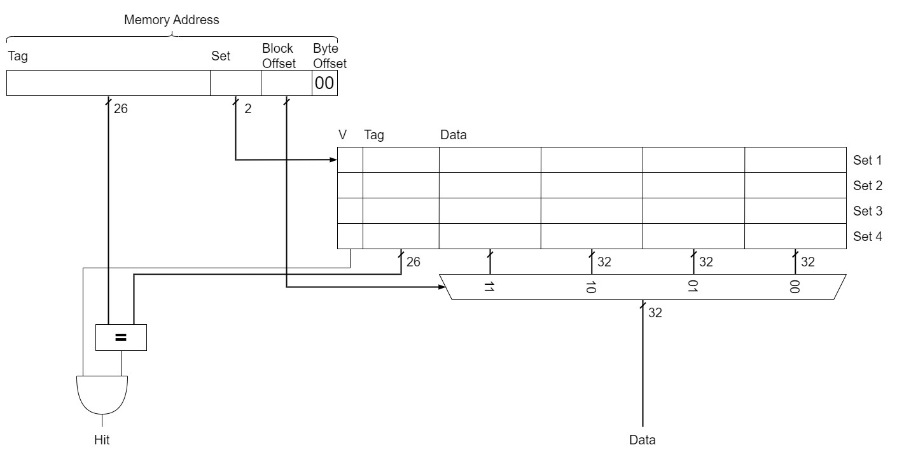
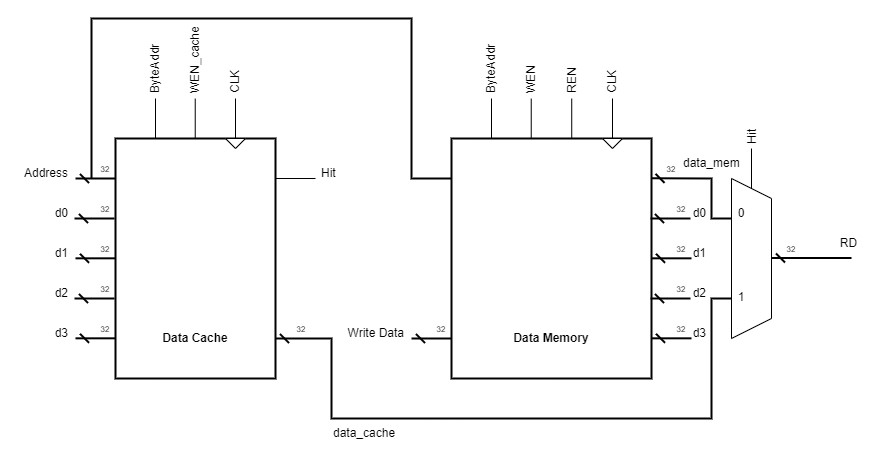

# Pipelined Processor with Data Cache.
## Contents
[File Listing](#file-listing)  
[Testing Instructions](#testing-instructions)  
[Test Results](#test-results)   
[Documentation](#documentation)  

## File Listing
> NB: This file listing contains only the components that required changing for this version, components that are in the top level, but aren't listed remained the same in terms of individual functonality to that of the single cycle processor or pipelined processor. You can see the file listing for those parts on the single cycle file listing or pipelined processor file listing. Alternatively, you can also view a combined file listing, with files from all goals.

Key: `x`: full responsibility; `p`: partial responsibility; `t`: testing

| File Name                | Steve | Sne | Divine | Yannis |
|--------------------------|-------|-----|--------|--------|
| cache.sv                 |       |     |        |        |
| combined_cache_memory.sv |       | p/t |        |        |
| data_memory.sv           |       | x/t |        |        |
| rd_mux.sv                |       | x   |        |        |
| top_level.sv             |       | x/t |        |        |

## Testing Instructions

## Test Results

## Documentation
    
For this stretch goal, we will be implementing a data cache designed for both temporal and spatial locality.

### Cache Organisation:

### Cache in the Top Level:
- Since the data cache interacts directly with the data memory, there needed to be some modifications to the data memory:

### Data Cache Functionality Overview:
- The address comes from the memory pipeline register.
- It is fed into the data cache that determines whether there is a hit or not.
- If there is a hit, then output data from the data cache is sent to the MUX that has hit as a select and hence the read data (RD) is the value from cache.
- When there is a hit, the read enable (REN) for data memory is disabled, effectively bypassing data memory.
- If there is a miss, data needs to be read from data memory and needs to be written to data cache in accordance with spatial locality.
- When there is a miss, REN is high and we read from data memory as before in the pipelined and single cycle processors. Since hit is low, the MUX chooses the data from data memory to be RD.
- We also need to write new data to the cache. The correct words are determined by the block offset part of the memory address. For example, if the block offset is `01` then we need to send back data of the current memory address, data of the memory address + 1 word (for block offset `10`), data of the memory address + 2 words (for block offset `11`) and the data of the memory address - 1 word (for block address `00`). Similar cases can be applied to the other 3 cases for the block offset.
- The new data is written into the cache and the valid bit is set to 1 regardless of previous result - the write enable for cache (WEN_cache) is high here.
- Both data cache and memory have an input ByteAddr, which was derermined from the control unit in the decode stage. This is to ensure that when perforaming load byte instructions, the data is correctly formatted - e.g, the `LBU` instructon.
- The data memory still can do normal writing operations - store word instructions.