# Pipelined Processor
## Contents
1. [File Listing](#file-listing)  
2. [Testing Instructions](#testing-instructions)  
3. [Test Results](#test-results)   
4. [Documentation](#documentation)  
5. [Unit Testing Documentation](#unit-testing-documentation)

## File Listing
> [!IMPORTANT] 
> This file listing contains only the components that required changing for this version, components that are in the top level, but aren't listed remained the same in terms of individual functonality to that of the single cycle processor. You can see the file listing for those parts on the [single cycle file listing](https://github.com/Nimosteve88/Team-3-RISCV-RV32I_Processor_Project/tree/main/rtl/single_cycle#file-listing). Alternatively, you can also view a [combined file listing](https://github.com/Nimosteve88/Team-3-RISCV-RV32I_Processor_Project/tree/main?tab=readme-ov-file#combined-file-listing), with files from all goals.

Key: `x`: full responsibility; `p`: partial responsibility; `t`: testing

| File Name                 | Steve | Sne | Divine | Yannis |
|---------------------------|-------|-----|--------|--------|
| control_unit_pipelined.sv |       | t   |   x    |       |
| decode.sv                 |   p   | t   |        |   x    |
| execute.sv                |   p   | t   |        |   x    |
| fetch.sv                  |   p   | t   |        |   x    |
| hazard.sv                 |       | t   |        |   x    |
| memory.sv                 |   p   | t   |        |   x    |
| pc_reg.sv                 |   p   |     |        |        |
| PCSrclogic.sv             |       | t   |   x    |        |
| rd1emux.sv                |   x   |     |        |        |
| rd2emux.sv                |   x   |     |        |        |
| top_level.sv              |       | x/t |        |        |
| write_back.sv             |   p   | t   |        |   x    |

## Testing Instructions
#### Testing the Formula 1 Program
1. Set up a connection to Vbuddy.
2. `cd` into the `pipelined` directory
3. Open the directory in VSCode - this is to edit the code so that correct instructions are run.
4. In `instruction_memory.sv` (located in the control folder) edit line 13 to the following:
```verilog
    $readmemh("f1.mem", instr_array);
```

5. In `data_memory.sv` (located in the data folder) comment out line 26 (we do not need to read anything into data memory for the F1 program):
```verilog
    //$readmemh("gaussian.mem", data_array, 17'h10000);
```

> [!NOTE]
> The commented out code has `gaussian.mem` in it - ignore this, this could have been any .mem file, for the sake of the F1 program, we don't care.

6. In the top level test bench file (`toplevel_tb.cpp`) comment out the code for the reference program and make sure that the code for the F1 program is uncommented:
```cpp
        // reference program
        // if (simcyc > 1300000 && simcyc % 2 == 0)
        // {  
        //     vbdPlot(int(top->a0), 0, 255);
        //     vbdCycle(simcyc);
        // }
        // end of reference program
        

        // F1 program:
        vbdCycle(simcyc);
        top->trigger_val = vbdFlag(); 
        vbdBar(top->a0 & 0xFF);
        vbdHex(3,(int(top->a0)>>8)&0xF);
        vbdHex(2,(int(top->a0)>>4)&0xF);
        vbdHex(1,int(top->a0)&0xF);
        // End of F1 program
```

7. In the Ubuntu 22.04.3 LTS terminal run the following command, having ensure that you have `cd`'d into the `pipelined` directory
```bash
source ./pipelined.sh
```
8. When the program has loaded onto the Vbuddy, you can start the program by pressing the trigger (rotary encoder). The F1 lights turn off after a "random" delay, the delay is determined by the value of the rotary encoder and an LFSR. To ensure this works, make sure that the rotary encoder is not at 0 when pressing the trigger.

9. We also included a small way of measuring reaction time, whilst this is definitely not accurate, in terms of measuring reaction time in seconds, it does provide a representation of reaction time. When lights go out, press the trigger again to record your reaction time. You will see your reaction time "score" outputted on both the display and the led bar.

> [!NOTE]
> Right now, we are aware that the trigger is a bit "glitchy" when recording reaction times, this is something that we would definitely get to the bottom to given more time

#### Testing the reference program
1. Set up a connection to Vbuddy.
2. `cd` into the `pipelined` directory
3. Open the directory in VSCode - this is to edit the code so that correct instructions are run.
4. In `instruction_memory.sv` (located in the control folder) edit line 13 to the following:
```verilog
    $readmemh("pdf.mem", instr_array);
```

5. In `data_memory.sv` (located in the data folder), make sure line 26 is uncommented and add the memory file for the desired probability distribution function e.g:
```verilog
    $readmemh("gaussian.mem", data_array, 17'h10000);
```

6. In the top level test bench file (`toplevel_tb.cpp`) comment out the code for the F1 program and make sure that the code for the reference program is uncommented:
```cpp
        // reference program
        if (simcyc > 1300000 && simcyc % 2 == 0)
        {  
            vbdPlot(int(top->a0), 0, 255);
            vbdCycle(simcyc);
        }
        // end of reference program
        

        // F1 program:
        // vbdCycle(simcyc);
        // top->trigger_val = vbdFlag(); 
        // vbdBar(top->a0 & 0xFF);
        // vbdHex(3,(int(top->a0)>>8)&0xF);
        // vbdHex(2,(int(top->a0)>>4)&0xF);
        // vbdHex(1,int(top->a0)&0xF);
        // End of F1 program
```

7. In the Ubuntu 22.04.3 LTS terminal run the following command, having ensure that you have `cd`'d into the `pipelined` directory
```bash
source ./pipelined.sh
```

8. The program will run automatically. Wait for a couple of seconds while the distribution is being built, then the display will plot the pdf. You should see pdfs that resemble that of those in the test results.
> [!NOTE]
> The testbench has lines to write output data to a csv file. If you want to do this, ensure that all lines related to csv file generation are uncommented.

## Test Results
#### F1 Program


https://github.com/Nimosteve88/Team-3-RISCV-RV32I_Processor_Project/assets/66144849/ccbf32fb-779d-41bf-9a27-0daa49e167ec


#### Reference Program
Videos for the reference program can be seen below


https://github.com/Nimosteve88/Team-3-RISCV-RV32I_Processor_Project/assets/66144849/6d27a1ff-dbbd-4057-b045-dbaf9a0921a7


https://github.com/Nimosteve88/Team-3-RISCV-RV32I_Processor_Project/assets/66144849/767919f9-fd3d-4d24-a247-6c8cb1e3701d


https://github.com/Nimosteve88/Team-3-RISCV-RV32I_Processor_Project/assets/66144849/5ebd6de4-3a6f-4b45-9f79-3bfad54c9593


https://github.com/Nimosteve88/Team-3-RISCV-RV32I_Processor_Project/assets/66144849/1b12e36c-ef37-4aaa-84d2-a581ba95558c


Additionally, CSV files with output data were generated for each distribution in the test bench. These were plotted and are as follows:

| 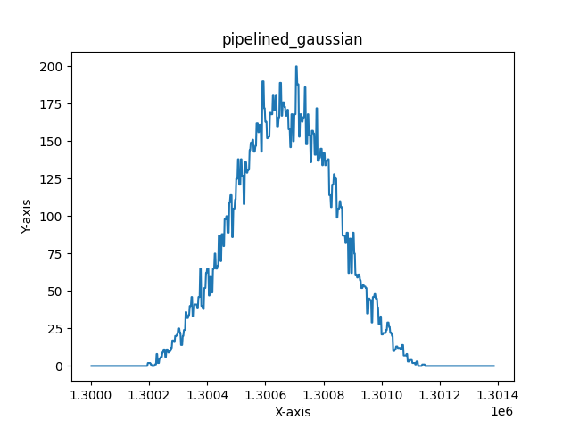 | 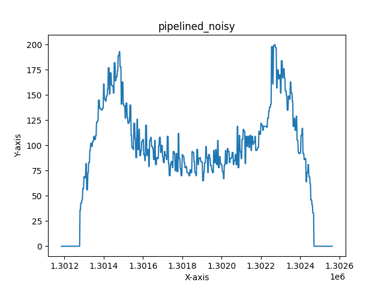       |
|---------------------------------------------------------------|---------------------------------------------------------------|
| 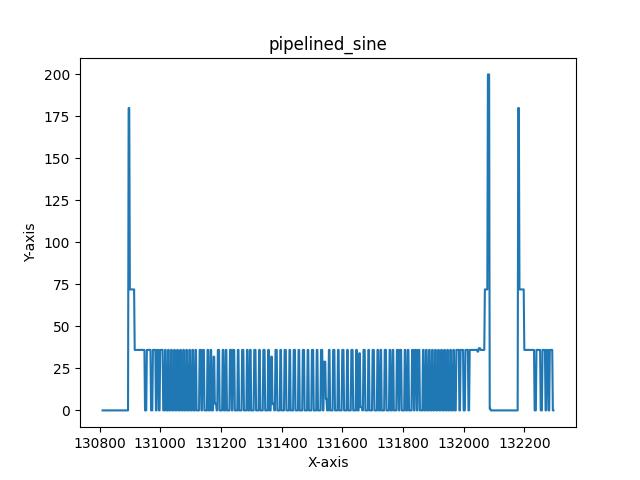         | 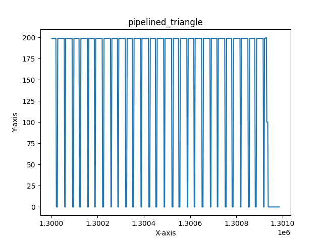 |

## Documentation
This is the single cycle processor from before:  
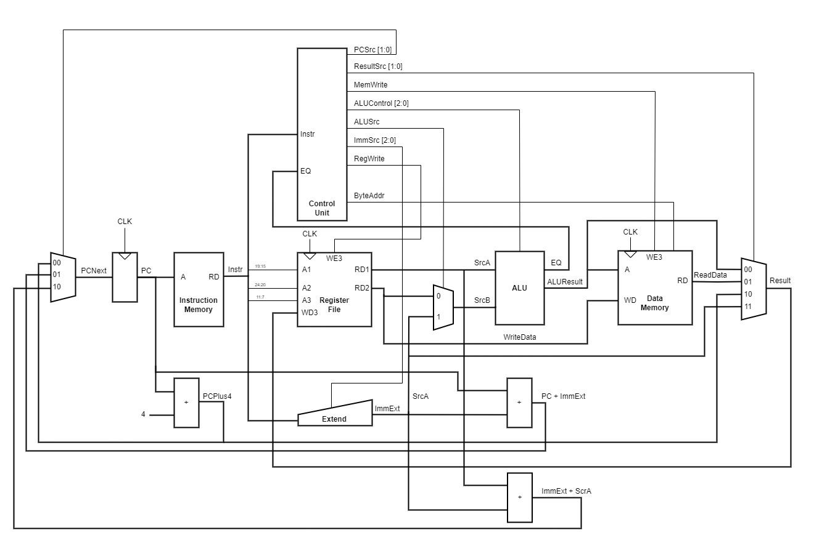

In order to successfully implement pipelining, the processor must be split into 5 stages. Each stage is associated with a particular part of the processor
| **Stage**  | **Abbreviation** | **Role**                                                                                                               |
|------------|------------------|------------------------------------------------------------------------------------------------------------------------|
| Fetch      | F                | Processor reads the instruction from instruction memory                                                                |
| Decode     | D                | Processor reads the source operands from the register file and decodes the instruction to produce the control signals. |
| Execute    | E                | Processor performs a computation with the ALU                                                                          |
| Memory     | M                | Processor reads or writes data memory, if applicable                                                                   |
| Write Back | W                | Processor writes the result to the register file, if applicable.                                                       |

It is important to note that the register file is used twice in every cycle (written in the first part and read in the second - writing done on the falling edge and reading done on the rising edge)

### Updated datapath with pipelining
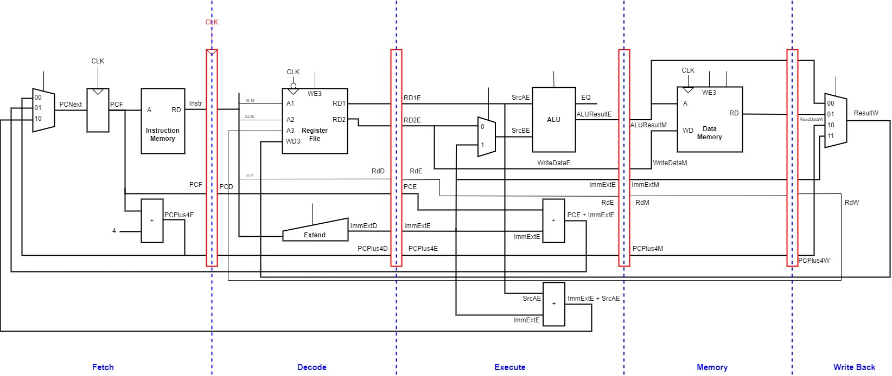

The destination register address has been pipelined as well so that the result data is in sync with the correct destination register when it is written to the register file.
### Updated controlpath with pipelining
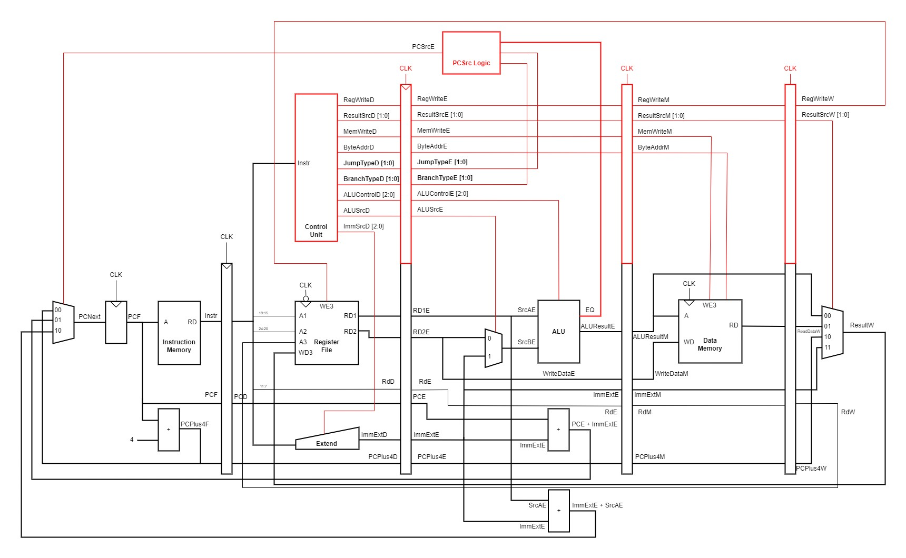
Control signals must be pipelined along with the data so that they remain synchronized with the instruction.4

It is not possible to calculate the PCSrc value within the control unit, since the we would need to effectively "pipeline back" the EQ flag from the execute stage. It makes most sense to work out PCSrc in the execute stage too since conditons for BEQ and BNE will be determined by the ALU in that current clock cycle. As such, there are 3 modifications:
1. JumpType [1:0] signal added from control
2. BranchType [1:0] signal added from control
3. PCSrc Logic Block added

The PCSrc logic block takes as input the type of branch or jump and the EQ flag and determines the correct PCSrc value.
The specifications for the new control signals is as follows:
JumpType [1:0]:
| JumpType[1] | JumpType[0] | Instruction |
|-------------|-------------|-------------|
| 0           | 0           | No Jump     |
| 0           | 1           | JAL         |
| 1           | 0           | JALR        |

Similarly for BranchType [1:0]:
| BranchType[1] | BranchType[0] | Instruction |
|-------------|-------------|-------------|
| 0           | 0           | No Branch     |
| 0           | 1           | BEQ         |
| 1           | 0           | BNE        |

Output logic for the PCSrc logic block:
| BranchType[1] | BranchType[0] | JumpType[1] | JumpType[0] | EQ | PCSrc[1] | PCSrc[0] |
|---------------|--------------|-------------|-------------|----|----------|---------|
| 0             | 0            | 0           | 0           | X  | 0        | 0       |
| 0             | 0            | 0           | 1           | X  | 0        | 1       |
| 0             | 0            | 1           | 0           | X  | 1        | 0       |
| 0             | 1            | 0           | 0           | 0  | 0        | 0       |
| 0             | 1            | 0           | 0           | 1  | 0        | 1       |
| 1             | 0            | 0           | 0           | 0  | 0        | 1       |
| 1             | 0            | 0           | 0           | 1  | 0        | 0       |

### Hazards
Hazards occur when one instruction's result is needed by a subsequent instruction before the former instruction has completed. There are 3 methods of resolving hazards:
1. Forwarding
2. Stalls
3. Flushes

> A software solution to hazards would invovle a programmer or compiler to insert `nop` instructions between hazard areas. This software solution is not ideal since it complicates programming and degrades performance.

2 Types of Hazards:
1. Data hazard: occurs when an instruction tries to read a register that has not yet been written back by a previous instruction.
2. Control hazard: occurs when the decision of what instruction to fetch next has not been made by the time the fetch takes place.

#### Forwarding:
- A method of solving data hazards.
- Requires adding MUXs in front of the ALU so that it selects its operands from the register file, memory or writeback stage.
- Forwarding is necessary when an instruction in the Execute stage has a source register matching the destination register of an instruction in the Memory or Writeback stage.

<div id="hazard"/>

#### Hazard Unit:

The development of the hazard unit was completed in accordance with section '7.5.3 Hazards' of _"Digital Design and Computer Architecture (RISC-V Edition)"_ by Sarah Harris and David Harris (pages 440 - 447). 

* **Solving Data Hazards with Forwarding:** 
In order to detect and solve data hazards, the hazard unit needed to be able to detect whether source registers of instructions currently in the *Execute stage (Rs1E & Rs2E)* the the same as destination registers of previous instructions currently in the *Memory (RdM)* or *Write-back (RdW)* stages, and to detect whether these instructions will actually affect the register file *(RegWriteM & RegWriteW)*. The Hazard Unit - using these inputs - produces *ForwardAE & ForwardBE* to control the MUXs in front of the ALU controlling whether each of the two operands should come from: the register file, the *Memory Stage (WriteDataM)* or the *Write-back stage (ResultW)*. (These connections are shown in the diagram following the end of this section.) 

**The logic implemented is the following (taken from page 443 of the textbook):**

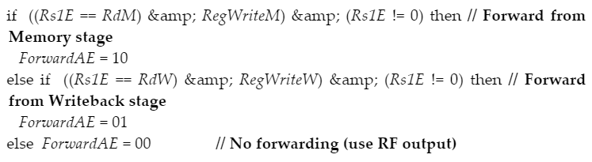

* **Solving Load Data Hazards with Stalls:**
With 'raw' data hazards, where the desired value exists within some stage of the pipelining - forwarding is effective, but when a load instruction - where the destination register is *RdE (from instruction currently in Execute Stage)* - is followed by any instruction where any of the source registers *Rs1D or Rs2D* are equal to it, a **stall** needs to occur. (The Hazard Unit knows whether the instruction at the execute stage is a `lw` instruction by checking if *ResultSrcE\[0\] == 0*) 

If these conditions are met, and a `lw` instruction has the same destination register as the following instruction's source address, then a **stall** must occur for the new instruction to wait for the value of destination register of the `lw` instruction to be updated. The stall must essentially pause all functionality of the *Fetch & Decode Stages*. Also, to prevent any leakage of instructions flowing through the pipeline from the *Execute Stage* onwards, the *Execute Stage* is **flushed**. 

* Stalls are implemented by adding enable signals to the *Fetch & Decode* pipeline registers, and having them be LOW when stalling.
* Flushes are implemented by adding CLR functionality to the *Execute Stage*.

Stalls and Flushes are controlled by the Hazard Unit via the outputs *StallF , StallD and FlushE* - corresponding to a stall in the *Fetch Stage*, a stall in the *Decode Stage* and a flush in the *Execute Stage*. (These connections are shown in the diagram following the end of this section.) 

**The logic implemented is the following (taken from page 445 of the textbook):**

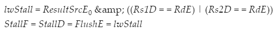

* **Solving Control Hazards:**
Jump type and conditional branch-type instructions also present a problem as whenever a branch or jump is taken, the correct next Program Counter address is only figured out by the *Execute Stage*. This means that whenever a branch or jump instruction is taken, the processor has already began working through two instructions that need to be terminated. This is done by **flushing** both the *Decode and Execute Stages*. 

In our processor, whether the next instructions being loaded into the pipeline is a jump or branch instruction, is indicated by `PCSrcE`. 
* `PCSrcE == 10  ->  Jump`
* `PCSrcE == 01  ->  Branch`

This led to the following code used to deal with Control Hazards:
```
// Avoiding execute for instructions following taken jumps or branches
branch_or_jump = ((PCSrcE == 2'b01) || (PCSrcE == 2'b10));
FlushD = branch_or_jump;
FlushE = branch_or_jump;
```

### Updated Processor with Hazard unit changes:
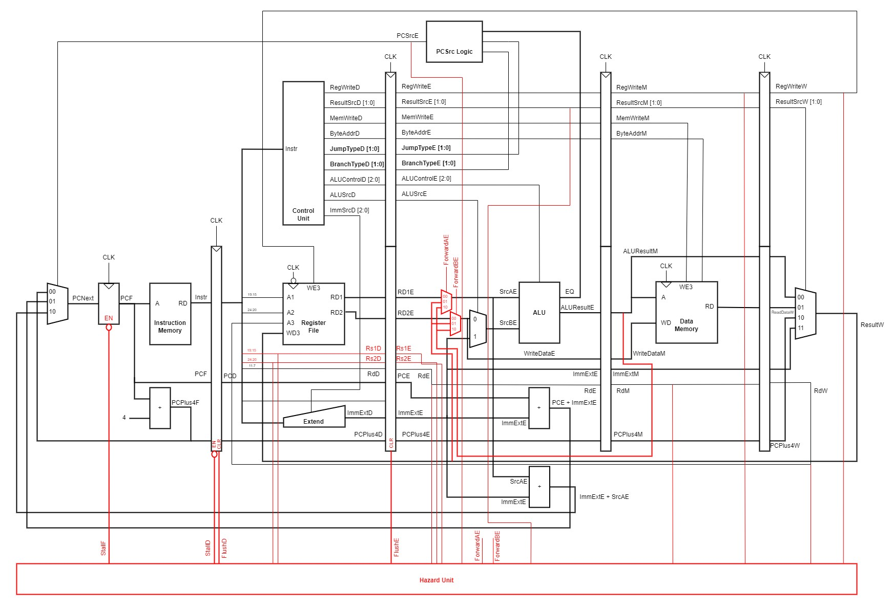

### Complete pipelined processor:
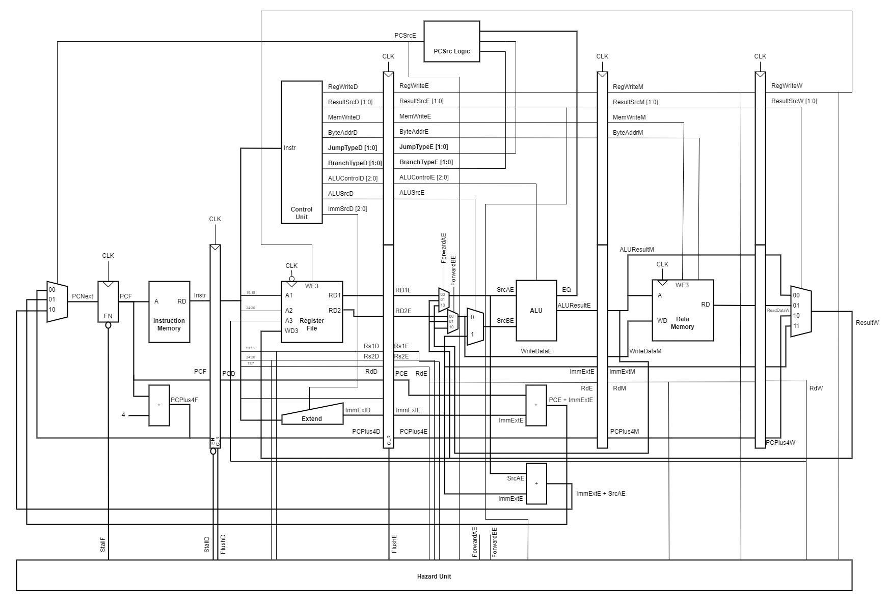

### Updated diagram with general fetch stage:
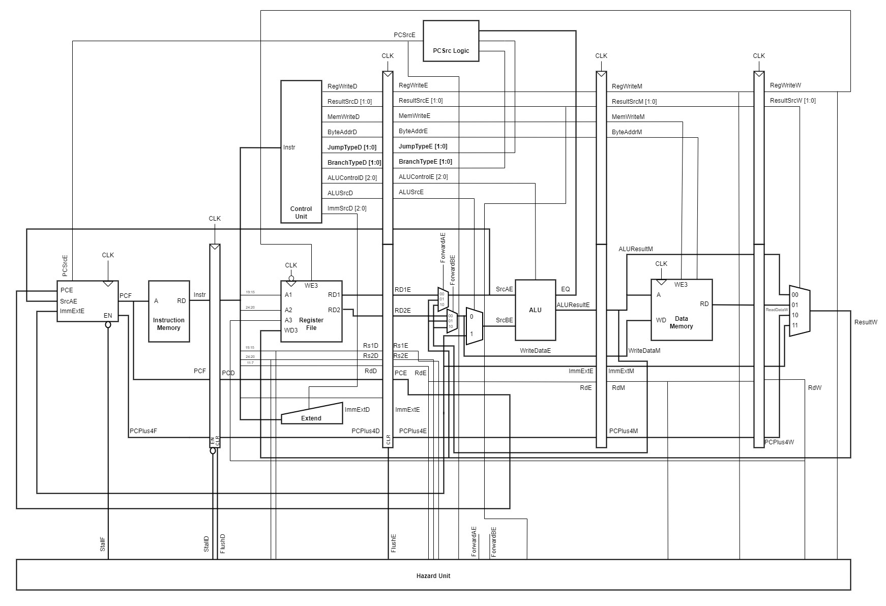

## Unit Testing Documentation
The following parts were tested individually with more detail on their testing process provided below:
- Updated Control Unit
- Hazard Unit
- PCSrc Logic
- Pipeline Registers

> [!NOTE]
> The other components in the pipelined processor either remained the same from the single cycle version - so they didn't require additional testing, or they were tested in the top level.

#### Updated Control Unit
- This followed an almost identical approach to that of the single cycle control unit. 
- Added cases for the new control signals - branch type and jump type
- The test bench can be found [here](https://github.com/Nimosteve88/Team-3-RISCV-RV32I_Processor_Project/blob/main/rtl/pipelined/tests/control_unit_pipelined_tb.cpp)
- All test cases were passed

#### Hazard unit
- I generated a multiple test cases, defined from different potential hazards which would require forwarding or stalling.
- The complete test bench can be found [here](https://github.com/Nimosteve88/Team-3-RISCV-RV32I_Processor_Project/blob/main/rtl/pipelined/tests/hazard_tb.cpp)
- Like with previous tests, I passed in inputs as a vector and expected outputs and checked whether they match the actual results. 
- All test cases were passed.

#### PCSrc Logic
- Followed a similar pattern to previous testing. 
- Tested all the cases for PCSrc with input conditions
- All test cases were passed.

#### Pipeline registers
- For pipeline registers, I chose to use GTKWave instead, with multiple signals, I thought it would be easier to just look at the waveform and see input transition to output on the next clock cycle.