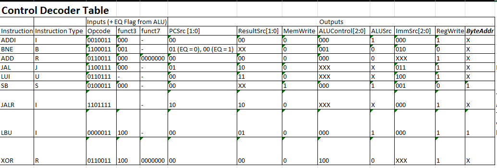

# Single Cycle
## Contents
1. [File Listing](#file-listing)  
2. [Testing Instructions](#testing-instructions)  
3. [Test Results](#test-results)   
4. [Documentation](#documentation)  
5. [Unit Testing Documentation](#unit-testing-documentation)

## File Listing
Key: `x`: full responsibility; `p`: partial responsibility; `t`: testing

| File Name             | Steve | Sne | Divine | Yannis |
|-----------------------|-------|-----|--------|--------|
| alu.sv                |       | t   |        |        |
| alu_src_mux.sv        |       |     |        |        |
| control_unit.sv       |       | t   |        |        |
| data_memory.sv        |       | x   |        |        |
| data_top_level.sv     |       |     |        |        |
| extend.sv             |       | p   |        |        |
| instruction_memory.sv |       |     |        |        |
| pc_module.sv          |       | t   |        | x      |
| pc_reg.sv             |       |     |        | x      |
| register_file.sv      |       | t   |        |        |
| result_mux.sv         |       | x   |        |        |
| toplevel.sv           |       | x/t |        |        |
| F1.s                  |       |     |        | x      |

## Testing Instructions
#### Testing the Formula 1 Program
1. Set up a connection to Vbuddy.
2. `cd` into the `single_cycle` directory
3. Open the directory in VSCode - this is to edit the code so that correct instructions are run.
4. In `instruction_memory.sv` (located in the control folder) edit line 13 to the following:
```verilog
    $readmemh("f1.mem", instr_array);
```

5. In `data_memory.sv` (located in the data folder) comment out line 24 (we do not need to read anything into data memory for the F1 program):
```verilog
    //$readmemh("gaussian.mem", data_array, 17'h10000);
```

> [!NOTE]
> The commented out code has `gaussian.mem` in it - ignore this, this could have been any .mem file, for the sake of the F1 program, we don't care.

6. In the top level test bench file (`toplevel_tb.cpp`) comment out the code for the reference program and make sure that the code for the F1 program is uncommented:
```cpp
        // reference program
        // if (simcyc > 1300000 && simcyc % 2 == 0)
        // {  
        //     vbdPlot(int(top->a0), 0, 255);
        //     vbdCycle(simcyc);
        // }
        // end of reference program
        

        // F1 program:
        vbdCycle(simcyc);
        top->trigger_val = vbdFlag(); 
        vbdBar(top->a0 & 0xFF);
        vbdHex(3,(int(top->a0)>>8)&0xF);
        vbdHex(2,(int(top->a0)>>4)&0xF);
        vbdHex(1,int(top->a0)&0xF);
        // End of F1 program
```

7. In the Ubuntu 22.04.3 LTS terminal run the following command, having ensure that you have `cd`'d into the `single_cycle` directory
```bash
source ./single.sh
```
8. When the program has loaded onto the Vbuddy, you can start the program by pressing the trigger (rotary encoder). The F1 lights turn off after a "random" delay, the delay is determined by the value of the rotary encoder and an LFSR. To ensure this works, make sure that the rotary encoder is not at 0 when pressing the trigger.

9. We also included a small way of measuring reaction time, whilst this is definitely not accurate, in terms of measuring reaction time in seconds, it does provide a representation of reaction time. When lights go out, press the trigger again to record your reaction time. You will see your reaction time "score" outputted on both the display and the led bar.

> [!NOTE]
> Right now, we are aware that the trigger is a bit "glitchy" when recording reaction times, this is something that we would definitely get to the bottom to given more time

#### Testing the reference program
1. Set up a connection to Vbuddy.
2. `cd` into the `single_cycle` directory
3. Open the directory in VSCode - this is to edit the code so that correct instructions are run.
4. In `instruction_memory.sv` (located in the control folder) edit line 13 to the following:
```verilog
    $readmemh("pdf.mem", instr_array);
```

5. In `data_memory.sv` (located in the data folder), make sure line 24 is uncommented and add the memory file for the desired probability distribution function e.g:
```verilog
    $readmemh("gaussian.mem", data_array, 17'h10000);
```

6. In the top level test bench file (`toplevel_tb.cpp`) comment out the code for the F1 program and make sure that the code for the reference program is uncommented:
```cpp
        // reference program
        if (simcyc > 1300000 && simcyc % 2 == 0)
        {  
            vbdPlot(int(top->a0), 0, 255);
            vbdCycle(simcyc);
        }
        // end of reference program
        

        // F1 program:
        // vbdCycle(simcyc);
        // top->trigger_val = vbdFlag(); 
        // vbdBar(top->a0 & 0xFF);
        // vbdHex(3,(int(top->a0)>>8)&0xF);
        // vbdHex(2,(int(top->a0)>>4)&0xF);
        // vbdHex(1,int(top->a0)&0xF);
        // End of F1 program
```

7. In the Ubuntu 22.04.3 LTS terminal run the following command, having ensure that you have `cd`'d into the `single_cycle` directory
```bash
source ./single.sh
```

8. The program will run automatically. Wait for a couple of seconds while the distribution is being built, then the display will plot the pdf. You should see pdfs that resemble that of those in the test results.

> [!NOTE]
> The testbench has lines to write output data to a csv file. If you want to do this, ensure that all lines related to csv file generation are uncommented.

## Test Results
#### F1 Program


https://github.com/Nimosteve88/Team-3-RISCV-RV32I_Processor_Project/assets/66144849/293393be-d84b-4561-9a0e-836e20b4378a


#### Reference Program
Videos for the reference program can be seen below


https://github.com/Nimosteve88/Team-3-RISCV-RV32I_Processor_Project/assets/66144849/e2467acb-1db6-473e-b374-a0244b811c4e


https://github.com/Nimosteve88/Team-3-RISCV-RV32I_Processor_Project/assets/66144849/43d47c97-a094-42e9-8363-1cf7bca31c15


https://github.com/Nimosteve88/Team-3-RISCV-RV32I_Processor_Project/assets/66144849/0994fbe8-5a79-4fb0-af32-36b7b1925aa2


https://github.com/Nimosteve88/Team-3-RISCV-RV32I_Processor_Project/assets/66144849/232581d0-de47-4ffb-ac0e-3463a5412a0b


Additionally, CSV files with output data were generated for each distribution in the test bench. These were plotted and are as follows:

|  |        |
|---------------------------------------------------------------|---------------------------------------------------------------|
|          |  |

## Documentation
This is the processor we built in Lab 4:


There are number of changes required from Lab 4: by looking at both the reference program and our [F1 RISC-V code (link to Yannis' Statement for an in depth description of the F1 Program)](https://github.com/Nimosteve88/Team-3-RISCV-RV32I_Processor_Project/blob/main/statements/Yannis.md#f1-assembly-code-program):
```
# Register usage
# t0 = Trigger register
# t1 = LFSR seed
# t2 = LFSR iteration counter
# t3 = Temporary register for LFSR computation
# t4 = VBuddy rotary value
# t5 = Counter for reaction time

# Main program
main_loop:
init:
    # Initialize lights output
    addi a0, zero, 0x0

    # Initialize the LFSR with a non-zero seed // when using vbuddy copy value of rotary thing to t1 upon initializing
    # addi t4, zero, 0x56

    # Initialize no. of times to run LFSR
    addi t2, zero, 0x3

    # Initialize useful values
    addi s1, zero, 0x1
    addi s2, zero, 0xff

    # 7th degree primitive polynomial
    addi s3, zero, 0x83 

    # addi t0, t0, 0x1


main_loop_idle:
    # Checking for trigger
    bne t0, s1, main_loop_idle

    # Set t0 back to zero once condition is met
    addi t0, zero, 0x0

    # Set nested ra
    add t6, zero, ra

    # Copy vbuddy rotary value once trigger is activated
    add t1, t4, zero
    beq t1, zero, main_loop

    # Call subroutine to setup FSM (demonstrating jalr)
    jalr ra, s1, 0x43

    # Call subroutine to perform FSM loop
    jal ra, fsm_loop

    # Call subroutine to perform LFSR
    jal ra, lfsr

    # Call subroutine to perform delay
    jal ra, delay

    # Call subroutine to turn off lights and measure reaction time
    jal ra, lights_off

    # reset ra
    add ra, t6, zero

    # Return to main loop
    ret

fsm_setup:
    # Make the output 1
    add a0, zero, s1
    add t5, zero, s1
    ret

fsm_loop:
    # Add t5 to itself and add 1 (left shift by 1 with 1 as lsb)
    add t5, t5, t5
    add t5, t5, s1

    # Set output to t5 to avoid lights incrementing in two steps
    add a0, t5, zero
    bne a0, s2, fsm_loop
    ret

lfsr:
    # Shift seed/working delay
    add t1, t1, t1

    # And working delay with primitive polynomial
    and t3, t1, s3

    # Xor nonzero polynomial bits with working delay
    xor t1, t1, t3

    # Reduce number of remaining loops 
    sub t2, t2, s1
    bne t2, zero, lfsr

    # Keep 5 lowest bits
    addi t3, zero, 0x1F
    and t1, t1, t3
    ret

delay:
    # Add noOps while the delay is decreasing
    nop 
    sub t1, t1, s1
    bne t1, zero, delay
    ret

lights_off:
    # Lights go off and reaction counter starts
    addi a0, zero, 0x0

    # Set counter to zero
    addi t5, zero, 0x0
    
count_reaction:
    # Increment timer by 1 and check for trigger
    add t5, t5, s1
    bne t0, s1, count_reaction

    # Set output to number of cycles elapsed
    add a0, zero, t5

    # NoOps added to increase display time
    nop
    nop
    nop
    nop
    nop

    ret
```

By listing all of the instructions necessary to successfully run both the F1 and the reference programs, we end up with the following: 

- ADDI (already done from lab4)
- BNE (already done from lab4)
- ADD
- JAL
- LUI
- SB
- JALR 
- LBU
- XOR
- AND 
- BEQ
- SUB

And in order to be able to run all of these types of instructions, we have implemented the changes highlighted in the diagram and further explained below:


1. **Data Memory**: Previously, we didn't have to read or store values into data memory. Now, with the introduction of `SB` and `LBU` we are both reading and writing to data memory. The data memory component must be built in accordance with the specified memory map. The WD (write data) input is always the RD2 value (value of register "rs2") since the `SB` instruction (where we are writing to the data memory) has the following format:
```
SB rs2, imm(rs1) --> the first byte of data at the address specified at (imm + rs1) = the first byte of the value at register rs2
```

The data memory has another control input apart from write enable, ByteAddr, I have added this in to specify when we want to preform a data write/store on the least significant byte (LSB) of a value at a given address (`SB`) or when we want to perform a 0 sign extension on the LSB of a value at a given address (`LBU`). 

2. **Result MUX**: In lab4, when writing to the register file, there was only one source of input data - from the ALU. However, now there are 4 different sources of write data:
    - Directly from the ALU (e.g `ADD`, `ADDI`, `XOR` instructions)
    - Data output from reading from data memory (`LBU`)
    - PC + 4 (Needed in the `JAL` and `JALR` instructions)
    - When we want to store an immediate value (`LUI`)
To correctly choose the value we want to write to the register, we implement a mux. The select comes directly from the control unit, in accordance with the instruction type.

3. **MUX for PCTarget**: Before, for `BNE` instructions, the PCTarget would be PC + ImmExt. Now we have `JAL` and `JALR` instructions to consider. For `JAL`, we have PCTarget = PC + ImmExt (same as before), but for `JALR` we have PCTarget = rs1 + ImmExt. This is used especially in thr `RET` instruction since before jumping, we store the next PC instruction (PC+4) in a register, so when returning from a subroutine, it makes sense to set PCTarget to that value we saved before jumping. Since both cases from PCTarget have ImmExt as common, it makes sense to implement a mux to choose what to add ImmExt with to get PCTarget (PC or rs1). The select from this comes from the control unit, and its value depends on the current instruction.
> [!IMPORTANT]
> This has been changed now PCSrc is set to be 2 bits long instead of 1 as before. The value of rs1 will be directly added with Imm and will be an option for the MUX related to PC, this also removes the need for the PCTargetSrc Signal - see updated diagram below

4. **Extend**: In lab4, we only had to consider immediate sign extension for 2 type of instruction, now we need to consider 5 types. As such the input, ImmSrc has an increased width to correctly determine the sign extended immediate format based of the current instruction.

5. **ALU**: We need to do more ALU operations than lab4 - AND, XOR, SUB

6. **Control Unit**: There are now more ouput signals based of the changes implemented above. Notably:
    - ResultSrc: Dtermines what data is being written to the register file.
    - MemWrite: An enable for writing or reading to data memory
    - ImmSrc: Increase width than lab4 to allow for more instruction type immediate sign extension.
    - PCTargetSrc: A mux select line to determine PCTarget, depending on `BNE`, `JAL` and `JALR` instruction types.
    - ByteAddr: A control input to determine how we modify outputs and inputs of data memory when we only want to focus on the least significant byte.

#### Control Decode Table:


#### Updated top level diagram:


##### Program Counter: 
The program counter module has been updated to be able to execute `JALR` instructions. This is done by:
Having adders calculate `PC + 4`, `PC + ImmExt` and `ImmExt + SrcA (ImmExt + Rs1)`.  By doing so for every current value of the `PC`, it meant that only a 3 input MUX was needed to implement all necessary instructions. The control signal for this MUX is (as mentioned above) `PCSrc [1:0]`. 

On the Program Counter side of things, `PCSrc` has the following effect:


| PCSrc [1:0] | Use Case | Instruction Types | Instructions Used|
| --------------- | --------------- | --------------- | --------------- |
| 00 | PC <- PC + 4 | R-type, I-type (apart from jalr), S-type | addi (li, noop), add, xor, sub, sb, lbu |
| 01 | PC <- PC + Imm | B-type, J-type | beq, bne, jal|
| 10 | PC <- Rs1 + Imm | (only used jalr, technically I-type) | jalr (ret)|
| 11 | ~~not used~~ | - | - |

## Unit Testing Documentation
The following parts were tested individually with more detail on their testing process provided below:
- ALU
- Control unit
- Sign extension unit
- Program counter

> [!NOTE]
> The other major components - register file, instruction memory and data memory were tested in the context of the top level component. This was primarily due to time purposes, I thought parts that ended up being tested were relatively more crucial to the correct functionality of the CPU and if something didn't work correctly, I could narrow it down to the parts that weren't tested.

#### ALU testing
- In the testbench I wrote functions to compare the output of the ALU with the expected result of the arithmetic operation, for example:
```cpp
bool check_addition(Valu *top, int a, int b, int expected)
{
    top->SrcA = a;
    top->SrcB = b;
    top->ALUctrl = 0;
    top->eval();
    return(top->ALUResult == expected);
}
```

- Similar functions were written for the following arithmetic functions: ADD, SUB, XOR, AND, EQ
- The check would be performed by all ALU functions, I decided to write a separate test case for this, just to make sure the equality check was working for a random ALU function.
- All test cases were passed.

#### Control unit testing
- To test the control unit, I wanted to evaluate the outputs of the control unit for the following test cases/ instructions:
    - ADD
    - JAL
    - JALR
    - LBU
    - ADDI
    - BNE (with EQ)
    - BNE (without EQ)
    - LUI
    - SB
    - XOR
    - AND
    - SUB
    - BEQ (with EQ)
    - BEQ (without EQ)

- I tested each instruction by passing an instruction of the correct type to function that passed it into the control unit under test. The outputs were taken and stored in a vector. Into this function, I also passed in the correct answers, which I determined myself and verified with team members. If every term matched then the test passed. This function can be seen in the [control unit test bench](https://github.com/Nimosteve88/Team-3-RISCV-RV32I_Processor_Project/blob/main/rtl/single_cycle/tests/control_unit_tb.cpp)
- For BEQ and BNE, where the output determined on the EQ flag, I passed the value of this flag to the function as well.
- All test cases were passed

#### Sign extension unit testing
- I tested the sign extension unit for I, S, B, J and U type instructions.
- Similar to the ALU and control unit, I wrote functions that compared an instruction's extended immediate to its expected value:
```cpp
bool check_I_type(Vextend *top, int instruction, int expected)
{
    top->Immsrc = 0;
    top->instr = instruction; 
    top->eval();
    return(top->Immop == expected);
}
```

- All test cases were passed.

#### PC module testing
- This followed a similar pattern to before. 
- I passed inputs to the PC module in vector form, stored the actual output and checked it agains the expected output.
```cpp
// define inputs for simulation
    std::vector<int> resets = {0, 0, 0, 1, 0, 0, 0, 0, 1, 0, 0, 0, 1, 0, 0, 0};
    std::vector<int> pc_src = {0, 0, 0, 0, 0, 1, 1, 1, 1, 1, 2, 2, 2, 0, 1, 2};
    std::vector<int> imm_op = {0, 4, 8, 12, 16, 20, 24, -4, 12, 36, -12, 64, 40, 44, 16, -4};
    std::vector<int> reg_in = {0, 8, 16, 24, 32, 40, 48, 56, 64, 72, 80, -8, 32, 36, 32, 32};

    // define expected outputs:
    // std::vector<int> expected_next_pc = {4, 8, 12, 0, 4, 24, 48, 44, 0, 36, 68, 56, 0, 4, 20, 28};
    std::vector<int> expected_pc = {0, 4, 8, 12, 0, 4, 24, 48, 44, 0, 36, 68, 56, 0, 4, 20};

    // initialise output vectors
    // std::vector<int> output_next_pc;
    std::vector<int> output_pc;
```

- If the test failed, I also wrote code to highlight in which cycle the program failed, so I knew what kind of case the program counter tripped up on.
- All test cases were passed.
