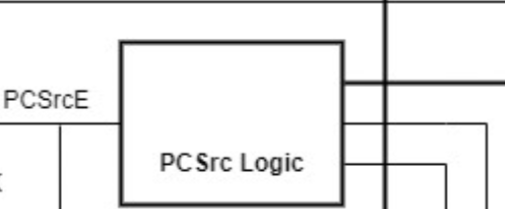

# Divine's Personal Statement

**CID:** 02208866                    **GitHub Username:** CB-W03     

## Quick Links
- [Contributions](#contributions)

- [reflection](#reflection)

## Contributions

### Control Unit ([Evidence]())

Single_Cycle Overview:

- Tasked with creating the control unit SV file and maintaining it as changes are being made to project.
- Considered I, S, B, J, and U type instructions (based on our F1 assembly program) and how the control unit generates the control signals based on the instruction word.
- Used this table:

- And studied the different instructions we would use, in our assembly code, to properly program control unit.

### Pipelining ([Evidence]())

- Made changes to the Control Unit to generate Jump and Branch signals based on the instruction word (in bold below)

- These tables used to generate Jump and Branch signals depending on the instruction word: 

JumpType [1:0]:                            
| JumpType[1] | JumpType[0] | Instruction |
|-------------|-------------|-------------|
| 0           | 0           | No Jump     |
| 0           | 1           | JAL         |
| 1           | 0           | JALR        |

BranchType [1:0]:
| BranchType[1] | BranchType[0] | Instruction |
|-------------|-------------|-------------|
| 0           | 0           | No Branch     |
| 0           | 1           | BEQ         |
| 1           | 0           | BNE        |

- Constructed to PCSrc logic block which would determine the value of PCSrc, which would determine whether the next value of PC will be PC + 4, PC + offset, or rs1 + offset.

- Value of PCSrc was determined by the Jump and Branch flags from the Control Unit, and the EQ flag from the ALU.

- PCSrc output logic determined by this table: 

| BranchType[1] | BranchType[0] | JumpType[1] | JumpType[0] | EQ | PCSrc[1] | PCSrc[0] |
|---------------|--------------|-------------|-------------|----|----------|---------|
| 0             | 0            | 0           | 0           | X  | 0        | 0       |
| 0             | 0            | 0           | 1           | X  | 0        | 1       |
| 0             | 0            | 1           | 0           | X  | 1        | 0       |
| 0             | 1            | 0           | 0           | 0  | 0        | 0       |
| 0             | 1            | 0           | 0           | 1  | 0        | 1       |
| 1             | 0            | 0           | 0           | 0  | 0        | 1       |
| 1             | 0            | 0           | 0           | 1  | 0        | 0       |

### Cache ([Evidence]())

## Reflection

