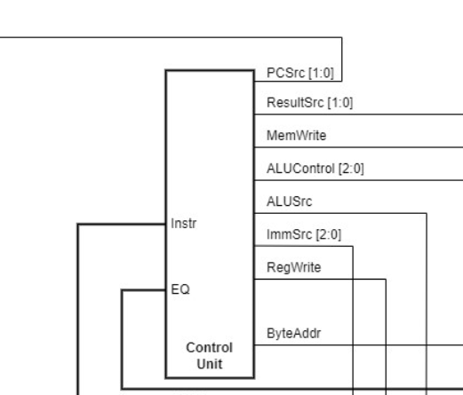
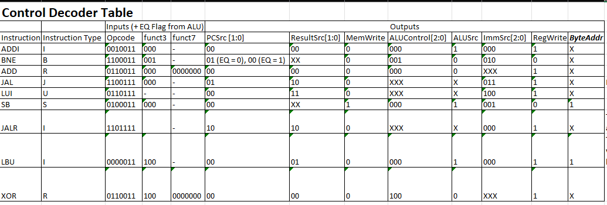
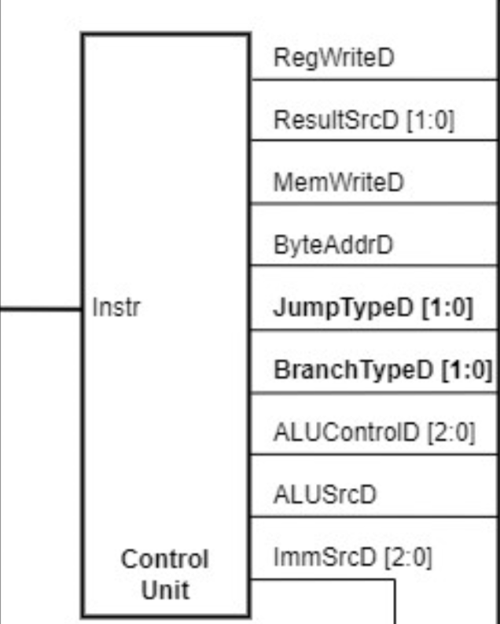
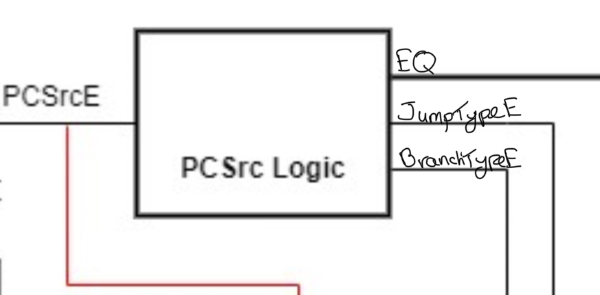

# Divine's Personal Statement

**CID:** 02208866                    **GitHub Username:** CB-W03     

## Quick Links
- [Contributions](#contributions)

- [reflection](#reflection)

## Contributions

### Control Unit ([Evidence]())

Single_Cycle Overview:

- Tasked with creating the control unit SV file and maintaining it as changes are being made to project.
- Considered I, S, B, J, and U type instructions (based on our F1 assembly program) and how the control unit generates the control signals based on the instruction word.
- Used this table:

- And studied the different instructions we would use, in our assembly code, and how they affected the different parts of the RV CPU, to properly program control unit.

### Pipelining ([Evidence]())

- In the pipelining I continued to oversee and modify the control unit, adding new Jump and Branch signals which would then be used by the PCSrc block to determine the next value of PC.

- I was able to properly program the logic for these signals based on the instruction word, using these tables with Sne's assistance: 

JumpType [1:0]:                            
| JumpType[1] | JumpType[0] | Instruction |
|-------------|-------------|-------------|
| 0           | 0           | No Jump     |
| 0           | 1           | JAL         |
| 1           | 0           | JALR        |

BranchType [1:0]:
| BranchType[1] | BranchType[0] | Instruction |
|-------------|-------------|-------------|
| 0           | 0           | No Branch     |
| 0           | 1           | BEQ         |
| 1           | 0           | BNE        |

- Constructed to PCSrc logic block which would determine the value of PCSrc, which would determine the next value of PC. Either:
 - PC = PC + 4
 - PC = PC + offset
 - PC = rs1 + offset

- Value of PCSrc was determined by the Jump and Branch flags from the Control Unit, and the EQ flag from the ALU.

- Using this table, I was able to properly program the PCSrc block output logic for the PCSrc signal: 

| BranchType[1] | BranchType[0] | JumpType[1] | JumpType[0] | EQ | PCSrc[1] | PCSrc[0] |
|---------------|--------------|-------------|-------------|----|----------|---------|
| 0             | 0            | 0           | 0           | X  | 0        | 0       |
| 0             | 0            | 0           | 1           | X  | 0        | 1       |
| 0             | 0            | 1           | 0           | X  | 1        | 0       |
| 0             | 1            | 0           | 0           | 0  | 0        | 0       |
| 0             | 1            | 0           | 0           | 1  | 0        | 1       |
| 1             | 0            | 0           | 0           | 0  | 0        | 1       |
| 1             | 0            | 0           | 0           | 1  | 0        | 0       |

## Reflection

