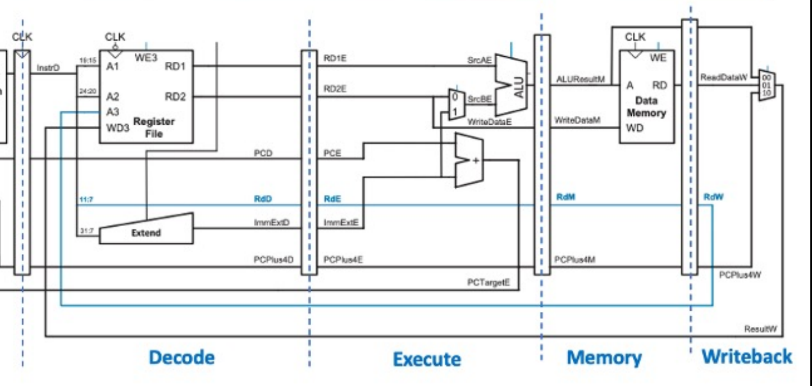

# Steve's Personal Statement

**CID:** 02254814                          **GitHub Username:** Nimosteve88

## Quick Links

- [Contributions](#contributions)

- [Reflection](#reflection)

- [Special design decisions](#special-design-decisions)

- [Given more time](#given-more-time)

## Contributions

### ALU  

Single_Cycle Overview:

- Took the role of overseeing and maintaining the construction and operation of the ALU.
- Considered the different type of Instructions (I, S, B, J  and U) and how they can affect the different operations and results the ALU produces.
- As we were initially told that we didn't have to use every single instruction, I prioritised my time studying the instructions we utilised in order to achieve the outputs. This allowed me to make my very own modifications to the ALU, most notably the ALUctrl since we were able to tailor its behaviour to operate in a way in which allowed our instructions to work smoothly.
- Main operations utilised in the ALU were ADD, SUB, AND and XOR. We made the decision to handle B and J type instructions within the control unit in order improve use of ALUctrl (more bits are available to use on wider range of instructions/operations).

### Register File 

- Constructed the Register File in order to store memory addresses and it's corresponding contents within a RAM of suitable size.
- As required the data is always read asynchronously to ensure the required data is always up to date while the data is writing synchronously at every rising edge of the clock.

### Pipelining 
Piplined Overview:

- Studied the behaviour of the pipeline registers and first attempted to construct the Pipeline registers. I later on recieved support from Yannis Zioulis in order to solidify the operation of the Pipelines so that it can also accomodate the Hazard Unit.

### Github Repository Master
- Took the role of 'Repo Master', setting up and overseeing the structure of the overall repository.

## Reflection 
- Taking on the role as the Repo Master has allowed me to improve my Git skills as well as steadily utilising softwares such as Github Desktop which helped significantly whenever I was doing constant check ups on the original repository
- Constructing the Register File helped me to deeply understand the operation of the registers from a low level point of view. This also supported me when constructing the Pipeline registers with the help of Yannis. 
- Overseeing the construction of ALU has also helped me to understand it's significance in the perfomance of different instructions; from the performing simple ADD and SUB instructions to understanding the role it plays in instructions like JALR and BNE.

## Special Design Decisions

-  Made modifications on ALUctrl to perform the operations we requested, instead of relying the traditional ALUctrl codes for every instruction.
- With the help of Sne Samal, testbenches were produced for the different areas I contributed in order to verify whether my work was successful.

## Given more time
- Although we were able to create our own version of Cache, it would have been ideal if I had undertaken study into more difficult Cache implementations, such as 4 way. The more 'ways' the Cache has, the better the CPU's performance will be. 