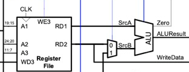

# Steve's Personal Statement

**CID:** 02254814                          **GitHub Username:** Nimosteve88

## Quick Links

- [Contributions](#contributions)

- [Reflection](#reflection)

- [Mistakes](#mistakes)

- [Special design decisions](#special-design-decisions)

- [Given more time](#given-more-time)

## Contributions

### ALU  ([Evidence]())

Single_Cycle Overview:

- Took the role of overseeing and maintaining the construction and operation of the ALU.
- Considered the different type of Instructions (I, S, B, J  and U) and how they can affect the different operations and results the ALU produces.
- As we were initially told that we didn't have to use every single instruction, I prioritised my time studying the instructions we utilised in order to achieve the outputs. This allowed me to make my very own modifications to the ALU, most notably the ALUctrl since we were able to tailor its behaviour to operate in a way in which allowed our instructions to work smoothly.
- Main operations utilised in the ALU were ADD, SUB, AND and XOR. We made the decision to handle B and J type instructions within the control unit in order improve use of ALUctrl (more bits are available to use on wider range of instructions/operations).

### Register File ([Evidence]())

- Constructed the Register File in order to store memory addresses and it's corresponding contents within a RAM of suitable size.
- As required the data is always read asynchronously to ensure the required data is always up to date while the data is writing synchronously at every rising edge of the clock.

### Pipelining ([Evidence]())

### Cache ([Evidence]())

## Reflection 

## Mistakes

## Special Design Decisions

-  Made modifications on ALUctrl to perform the operations we requested, instead of relying the traditional ALUctrl codes for every instruction.

## Given more time

