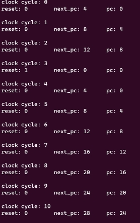

# Yannis Zioulis' Personal Statement
### CID: 02223077  |  GitHub username: yanniszioulis

---
##  Summary of Contributions

*  Built and tested the [Program Counter](#pc)
*  Wrote and tested the[ F1 Light Sequence assembly code program](#f1)
*  Built the Hazard Detection Unit and helped in the design, debugging and testing of the Pipeline Registers
* Helped in building the Cache, and helped test our Cache Memory system

## Contributions
<div id="pc"/>

### Program Counter 
My first contribution was building the Program Counter (a task which was randomly assigned to me for Lab 4. I continued modifying the PC to make sure it works for the single-cycle, pipelined and cache versions of our CPU). 

My final design of the PC for Lab 4 can by seen by Sne's commit [824c2c3](https://github.com/Nimosteve88/Team-3-RISCV-RV32I_Processor_Project/commit/824c2c392575be7485710e18ccce1e39f5f9e49a) where the files were copied over. The development of the Program Counter then continued with my design choice to include a 2-bit `PCSrc` input signal (although only 3 of the 4 inputs were needed to implement the instructions necessary to run the reference and f1 programs).  

See commit [05291c3](https://github.com/Nimosteve88/Team-3-RISCV-RV32I_Processor_Project/commit/05291c32b537287012723846c5f68ebc26844e28) for the adjustments made to the Program Counter, the Control Unit, the Datapath and the Top Level to accommodate for the `JALR` instruction. 

Finally, as a result of Sne's testing, we found that the Program Counter would would take **2 clock cycles to resume normal operation after a reset input.**



This issue was caused by the fact that both `pc_module.sv` (the pc 'top')  would set `pc_next` to 0, and `pc_reg.sv` (the register itself) would set the stored value to 0. This would effectively create a two-cycle bubble which was resolved with commit [ac768a0](https://github.com/Nimosteve88/Team-3-RISCV-RV32I_Processor_Project/commit/ac768a058ef602ffd99314098295a2d83d68e19b). 

By overcoming this error, we arrived at the final version of the PC module which is used by the single cycle version of our CPU. [Single Cycle Program Counter](https://github.com/Nimosteve88/Team-3-RISCV-RV32I_Processor_Project/tree/main/rtl/single_cycle#pc).

The pipelined and pipelined+cache versions of the CPU saw `pc_module.sv` evolve to `fetch.sv` which I will cover below.

<div id="f1"/>

### F1 Assembly Code Program

The initial idea for the F1 light sequence program was to have it resemble the real life F1 light sequence as closely as possible, and add functionality that is able to time one's reaction. In trying to do so I came across several challenges such as:

* Simulating randomness (getting to a satisfactory level of pseudo-randomness)
* Timing the reaction time
* Integrating a trigger
* Working on the code without the ability to test it using our CPU, as it was still in its Lab 4 state when I started.

#### Prototype Program

In order to address the final challenge, I decided to build a prototype F1 Program that would work without any jumps as I knew these instructions would be implemented and tested last. Also, I decided to use an [Online Interpreter](https://www.cs.cornell.edu/courses/cs3410/2019sp/riscv/interpreter/) to test my code while our processor was still being built and tested. 

> (By prototype F1 Program, I am referring to the `F1_simple.s` file found in the [test folder](https://github.com/Nimosteve88/Team-3-RISCV-RV32I_Processor_Project/blob/main/test/F1_simple.s).)

The prototype program:
```
init:
    # Initialize lights output
    addi a0, zero, 0x0

    # Initialize the LFSR with a non-zero seed // when using vbuddy copy value of rotary thing to t1 upon initializing
    addi t4, zero, 0x55

    # Initialize no. of times to run LFSR
    addi t2, zero, 0x3

    # Initialize useful values
    addi s1, zero, 0x1
    addi s2, zero, 0xff

    # 7th degree primitive polynomial
    addi s3, zero, 0x83 


idle:
    # Checking for trigger
    bne t0, s1, idle

    # Set t0 back to zero once condition is met
    addi t0, zero, 0x0

    # Copy vbuddy rotary value once trigger is activated
    add t1, t4, zero
    beq t1, zero, init

fsm_setup:
    # Make the output 1
    add a0, zero, s1
    add t5, zero, s1
    bne a0, s1, fsm_setup

fsm_loop:
    # Add t5 to itself and add 1 (left shift by 1 with 1 as lsb)
    add t5, t5, t5
    add t5, t5, s1

    # Set output to t5 to avoid lights incrementing in two steps
    add a0, t5, zero
    bne a0, s2, fsm_loop

lfsr:
    # Shift seed/working delay
    add t1, t1, t1

    # And working delay with primitive polynomial
    and t3, t1, s3

    # Xor nonzero polynomial bits with working delay
    xor t1, t1, t3

    # Reduce number of remaining loops 
    sub t2, t2, s1
    bne t2, zero, lfsr

delay:
    # Add noOps while the delay is decreasing
    nop 
    sub t1, t1, s1
    bne t1, zero, delay

lights_off:
    # lights go off and back to init and idle
    addi a0, zero, 0x0
    jal zero, init
```

* Subroutine `init` is responsible for setting up key values such as the primitive polynomial to `s3`, a non-zero seed to be tested on the online interpreter to `t4` (later to be copied to `t1`, as I didn't want vbdvalue affecting the lfsr value once the program had began), 0xFF to `s2` to signal the end of the light sequence etc.

* Subroutine `idle` is responsible for waiting for trigger activation, and copying vbdvalue for the reason mentioned above.

* Subroutines `fsm_setup` and `fsm` are responsible for the light sequence itself - made possible by making `a0` 1, and then adding it to itself until it reaches a value of 0xFF.

* Subroutine `lfsr` is a linear feedback system using the 7-th degree primitive polynomial `x^7 + x + 1 OR 0x83`, and passing the 'working delay (`t1`)' through it 3 times. 

* The result of the LFSR is then what determines the number of loops spent in the `delay` function before `lights_off`.

> Important to note that the final line `jal` instruction was added after `jal` instructions were verified to be working as expected.

#### Final Version of the F1 Program

The final version of the program is an evolution from the prototype, only this time traditional subroutines were implemented using `jal` and `jalr (ret)` instructions, the program has a `main` and finally - reaction timing has been added.  

The code in its final version looks like this:

```
# Register usage
# t0 = Trigger register
# t1 = LFSR seed
# t2 = LFSR iteration counter
# t3 = Temporary register for LFSR computation
# t4 = VBuddy rotary value
# t5 = Counter for reaction time

# Main program
main_loop:
init:
    # Initialize lights output
    addi a0, zero, 0x0

    # Initialize the LFSR with a non-zero seed // when using vbuddy copy value of rotary thing to t1 upon initializing
    # addi t4, zero, 0x56

    # Initialize no. of times to run LFSR
    addi t2, zero, 0x3

    # Initialize useful values
    addi s1, zero, 0x1
    addi s2, zero, 0xff

    # 7th degree primitive polynomial
    addi s3, zero, 0x83 

    # addi t0, t0, 0x1


main_loop_idle:
    # Checking for trigger
    bne t0, s1, main_loop_idle

    # Set t0 back to zero once condition is met
    addi t0, zero, 0x0

    # Set nested ra
    add t6, zero, ra

    # Copy vbuddy rotary value once trigger is activated
    add t1, t4, zero
    beq t1, zero, main_loop

    # Call subroutine to setup FSM (demonstrating jalr)
    jalr ra, s1, 0x43

    # Call subroutine to perform FSM loop
    jal ra, fsm_loop

    # Call subroutine to perform LFSR
    jal ra, lfsr

    # Call subroutine to perform delay
    jal ra, delay

    # Call subroutine to turn off lights and measure reaction time
    jal ra, lights_off

    # reset ra
    add ra, t6, zero

    # Return to main loop
    ret

fsm_setup:
    # Make the output 1
    add a0, zero, s1
    add t5, zero, s1
    ret

fsm_loop:
    # Add t5 to itself and add 1 (left shift by 1 with 1 as lsb)
    add t5, t5, t5
    add t5, t5, s1

    # Set output to t5 to avoid lights incrementing in two steps
    add a0, t5, zero
    bne a0, s2, fsm_loop
    ret

lfsr:
    # Shift seed/working delay
    add t1, t1, t1

    # And working delay with primitive polynomial
    and t3, t1, s3

    # Xor nonzero polynomial bits with working delay
    xor t1, t1, t3

    # Reduce number of remaining loops 
    sub t2, t2, s1
    bne t2, zero, lfsr

    # Keep 5 lowest bits
    addi t3, zero, 0x1F
    and t1, t1, t3
    ret

delay:
    # Add noOps while the delay is decreasing
    nop 
    sub t1, t1, s1
    bne t1, zero, delay
    ret

lights_off:
    # Lights go off and reaction counter starts
    addi a0, zero, 0x0

    # Set counter to zero
    addi t5, zero, 0x0
    
count_reaction:
    # Increment timer by 1 and check for trigger
    add t5, t5, s1
    bne t0, s1, count_reaction

    # Set output to number of cycles elapsed
    add a0, zero, t5

    # NoOps added to increase display time
    nop
    nop
    nop
    nop
    nop

    ret
```

The program is exactly the same as the prototype other than these minor differences:

* After `lights_off`, the program goes directly into `count_reaction` where a counter is set until the trigger is activated. Once activated, `a0` is set to the value of the reaction (in units of clock cycles - I did not want to add a multiple of the time taken per cycle as that is different for every computer running the program.)

* After the 3rd LFSR cycle, by which point the delay has been calculated, I decided to keep the 5 least significant bits to limit the delay. 

* Finally a set of NoOps was added to the ending before returning to the main_loop. 

*Important to note that the program uses a nested subroutine jumps in the `main_loop_idle` subroutine which requires storing and recovering the return address. (This was done by using register `t6`)*
  
> [!IMPORTANT]
> By testing the program with vBuddy, I have become aware of the 'glitchy-ness' of the trigger in recording the reaction scores. This is something that I would definitely address if I had more time.

---

## What I learned 

### Git
[Discuss your experience with Git, including specific commands used, problem-solving, and collaboration with team members.]

### Markdown
[Describe your use of Markdown for documentation purposes.]

### System Verilog and Verilator
[Discuss your learning experience with System Verilog and Verilator, highlighting your comfort level and ability to handle common errors.]

### Debugging skills
[Explain how you improved your debugging skills, whether through GTKwave or other tools.]

### Group dynamics
[Share your insights into working within a team, including the importance of giving team members creative space and time to work at their own pace.]

---

## Mistakes

* [Reflect on any mistakes made during the project and what you learned from them.]

---

## Design Decisions
* [Outline any design decisions you made during the project, including why you chose specific approaches.]

> [Include visuals or diagrams if necessary.]

---

## Next time
[Discuss what you would do differently next time, any improvements you would make, and lessons learned.]

---

## Acknowledgments
[If there are specific individuals or resources you want to acknowledge, include them here.]

---

## References
[List any references or links to specific commits, branches, or documents mentioned in your statement.]

---

[Include any additional sections or details you find relevant to your personal statement. Customize the template to fit your specific experiences and contributions.]
