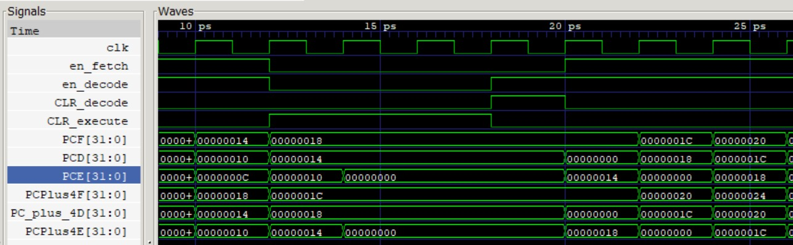
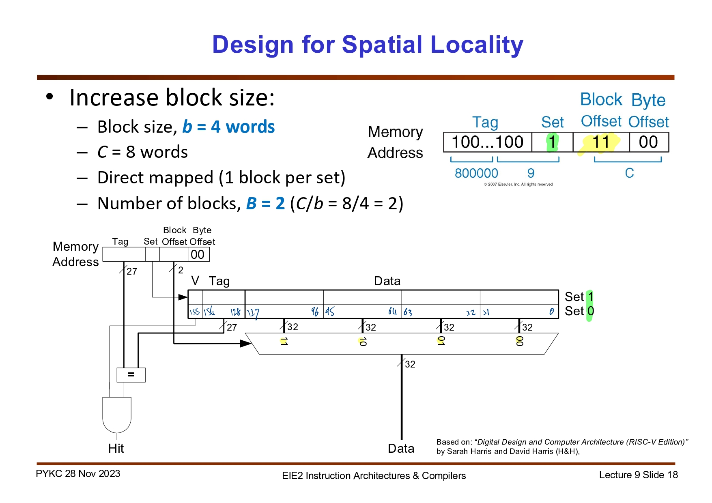

# Yannis Zioulis' Personal Statement
### CID: 02223077  |  GitHub username: yanniszioulis

---
##  Summary of Contributions

*  Built and tested the [Program Counter](#pc)
*  Wrote and tested the[ F1 Light Sequence assembly code program](#f1)
*  Built the [Hazard Detection Unit](#hazard) and helped in the [design, debugging and testing of the Pipeline Registers](#pipeline)
*  Built the [Cache](#cache)

### If you'd like to skip ahead:

* [What I learned](#learn)
* [Design Decisions](#decisions)
* [Next time](#next_time)
## Contributions
<div id="pc"/>

### Program Counter 
My first contribution was building the Program Counter (a task which was randomly assigned to me for Lab 4. I continued modifying the PC to make sure it works for the single-cycle, pipelined and cache versions of our CPU). 

My final design of the PC for Lab 4 can by seen by Sne's commit [824c2c3](https://github.com/Nimosteve88/Team-3-RISCV-RV32I_Processor_Project/commit/824c2c392575be7485710e18ccce1e39f5f9e49a) where the files were copied over. The development of the Program Counter then continued with my design choice to include a 2-bit `PCSrc` input signal (although only 3 of the 4 inputs were needed to implement the instructions necessary to run the reference and f1 programs).  

See commit [05291c3](https://github.com/Nimosteve88/Team-3-RISCV-RV32I_Processor_Project/commit/05291c32b537287012723846c5f68ebc26844e28) for the adjustments made to the Program Counter, the Control Unit, the Datapath and the Top Level to accommodate for the `JALR` instruction. 

Finally, as a result of Sne's testing, we found that the Program Counter would would take **2 clock cycles to resume normal operation after a reset input.**


This issue was caused by the fact that both `pc_module.sv` (the pc 'top')  would set `pc_next` to 0, and `pc_reg.sv` (the register itself) would set the stored value to 0. This would effectively create a two-cycle bubble which was resolved with commit [ac768a0](https://github.com/Nimosteve88/Team-3-RISCV-RV32I_Processor_Project/commit/ac768a058ef602ffd99314098295a2d83d68e19b). 

By overcoming this error, we arrived at the final version of the PC module which is used by the single cycle version of our CPU. [Single Cycle Program Counter](https://github.com/Nimosteve88/Team-3-RISCV-RV32I_Processor_Project/tree/main/rtl/single_cycle#pc)

The pipelined and pipelined+cache versions of the CPU saw `pc_module.sv` evolve to `fetch.sv` which I will cover below.

<div id="f1"/>

### F1 Assembly Code Program

The initial idea for the F1 light sequence program was to have it resemble the real life F1 light sequence as closely as possible, and add functionality that is able to time one's reaction. In trying to do so I came across several challenges such as:

* Simulating randomness (getting to a satisfactory level of pseudo-randomness)
* Timing the reaction time
* Integrating a trigger
* Working on the code without the ability to test it using our CPU, as it was still in its Lab 4 state when I started.

> *All of the versions of the program were converted into machine code via the [RISC-V Online Assembler](https://riscvasm.lucasteske.dev/) recommended to us by Prof. Peter Cheung.*

#### Prototype Program

In order to address the final challenge, I decided to build a prototype F1 Program that would work without any jumps as I knew these instructions would be implemented and tested last. Also, I decided to use an [Online Interpreter](https://www.cs.cornell.edu/courses/cs3410/2019sp/riscv/interpreter/) to test my code while our processor was still being built and tested. 

> (By prototype F1 Program, I am referring to the `F1_simple.s` file found in the [test folder](https://github.com/Nimosteve88/Team-3-RISCV-RV32I_Processor_Project/blob/main/test/F1_simple.s).)

The prototype program:
```
init:
    # Initialize lights output
    addi a0, zero, 0x0

    # Initialize the LFSR with a non-zero seed // when using vbuddy copy value of rotary thing to t1 upon initializing
    addi t4, zero, 0x55

    # Initialize no. of times to run LFSR
    addi t2, zero, 0x3

    # Initialize useful values
    addi s1, zero, 0x1
    addi s2, zero, 0xff
    
    # 7th degree primitive polynomial
    addi s3, zero, 0x83 

idle:
    # Checking for trigger
    bne t0, s1, idle

    # Set t0 back to zero once condition is met
    addi t0, zero, 0x0

    # Copy vbuddy rotary value once trigger is activated
    add t1, t4, zero
    beq t1, zero, init

fsm_setup:
    # Make the output 1
    add a0, zero, s1
    add t5, zero, s1
    bne a0, s1, fsm_setup

fsm_loop:
    # Add t5 to itself and add 1 (left shift by 1 with 1 as lsb)
    add t5, t5, t5
    add t5, t5, s1

    # Set output to t5 to avoid lights incrementing in two steps
    add a0, t5, zero
    bne a0, s2, fsm_loop

lfsr:
    # Shift seed/working delay
    add t1, t1, t1

    # And working delay with primitive polynomial
    and t3, t1, s3

    # Xor nonzero polynomial bits with working delay
    xor t1, t1, t3

    # Reduce number of remaining loops 
    sub t2, t2, s1
    bne t2, zero, lfsr

delay:
    # Add noOps while the delay is decreasing
    nop 
    sub t1, t1, s1
    bne t1, zero, delay

lights_off:
    # lights go off and back to init and idle
    addi a0, zero, 0x0
    jal zero, init
```

* Subroutine `init` is responsible for setting up key values such as the primitive polynomial to `s3`, a non-zero seed to be tested on the online interpreter to `t4` (later to be copied to `t1`, as I didn't want vbdvalue affecting the lfsr value once the program had began), 0xFF to `s2` to signal the end of the light sequence etc.

* Subroutine `idle` is responsible for waiting for trigger activation, and copying vbdvalue for the reason mentioned above.

* Subroutines `fsm_setup` and `fsm` are responsible for the light sequence itself - made possible by making `a0` 1, and then adding it to itself until it reaches a value of 0xFF.

* Subroutine `lfsr` is a linear feedback system using the 7-th degree primitive polynomial `x^7 + x + 1 OR 0x83`, and passing the 'working delay (`t1`)' through it 3 times. 

* The result of the LFSR is then what determines the number of loops spent in the `delay` function before `lights_off`.

> Important to note that the final line `jal` instruction was added after `jal` instructions were verified to be working as expected.

> *See commit [a691311](https://github.com/Nimosteve88/Team-3-RISCV-RV32I_Processor_Project/commit/a69131168a8793c8ee18715aecf6f55baf8990f1) for the final version of the prototype f1 program after online interpreter testing. (Minor adjustments followed but this was the last substantial adjustment.)*
#### Final Version of the F1 Program

The final version of the program is an evolution from the prototype, only this time traditional subroutines were implemented using `jal` and `jalr (ret)` instructions, the program has a `main` and finally - reaction timing has been added.  

The code in its final version looks like this:

```
# Register usage
# t0 = Trigger register
# t1 = LFSR seed
# t2 = LFSR iteration counter
# t3 = Temporary register for LFSR computation
# t4 = VBuddy rotary value
# t5 = Counter for reaction time

# Main program
main_loop:
init:
    # Initialize lights output
    addi a0, zero, 0x0

    # Initialize the LFSR with a non-zero seed // when using vbuddy copy value of rotary thing to t1 upon initializing
    # addi t4, zero, 0x56

    # Initialize no. of times to run LFSR
    addi t2, zero, 0x3

    # Initialize useful values
    addi s1, zero, 0x1
    addi s2, zero, 0xff

    # 7th degree primitive polynomial
    addi s3, zero, 0x83 

    # addi t0, t0, 0x1

main_loop_idle:
    # Checking for trigger
    bne t0, s1, main_loop_idle

    # Set t0 back to zero once condition is met
    addi t0, zero, 0x0

    # Set nested ra
    add t6, zero, ra

    # Copy vbuddy rotary value once trigger is activated
    add t1, t4, zero
    beq t1, zero, main_loop

    # Call subroutine to setup FSM (demonstrating jalr)
    jalr ra, s1, 0x43

    # Call subroutine to perform FSM loop
    jal ra, fsm_loop

    # Call subroutine to perform LFSR
    jal ra, lfsr

    # Call subroutine to perform delay
    jal ra, delay

    # Call subroutine to turn off lights and measure reaction time
    jal ra, lights_off

    # reset ra
    add ra, t6, zero

    # Return to main loop
    ret

fsm_setup:
    # Make the output 1
    add a0, zero, s1
    add t5, zero, s1
    ret

fsm_loop:
    # Add t5 to itself and add 1 (left shift by 1 with 1 as lsb)
    add t5, t5, t5
    add t5, t5, s1

    # Set output to t5 to avoid lights incrementing in two steps
    add a0, t5, zero
    bne a0, s2, fsm_loop
    ret

lfsr:
    # Shift seed/working delay
    add t1, t1, t1

    # And working delay with primitive polynomial
    and t3, t1, s3

    # Xor nonzero polynomial bits with working delay
    xor t1, t1, t3

    # Reduce number of remaining loops 
    sub t2, t2, s1
    bne t2, zero, lfsr

    # Keep 5 lowest bits
    addi t3, zero, 0x1F
    and t1, t1, t3
    ret

delay:
    # Add noOps while the delay is decreasing
    nop 
    sub t1, t1, s1
    bne t1, zero, delay
    ret

lights_off:
    # Lights go off and reaction counter starts
    addi a0, zero, 0x0

    # Set counter to zero
    addi t5, zero, 0x0
    
count_reaction:
    # Increment timer by 1 and check for trigger
    add t5, t5, s1
    bne t0, s1, count_reaction

    # Set output to number of cycles elapsed
    add a0, zero, t5

    # NoOps added to increase display time
    nop
    nop
    nop
    nop
    nop

    ret
```

The program is exactly the same as the prototype other than these minor differences:

* After `lights_off`, the program goes directly into `count_reaction` where a counter is set until the trigger is activated. Once activated, `a0` is set to the value of the reaction (in units of clock cycles - I did not want to add a multiple of the time taken per cycle as that is different for every computer running the program.)

* After the 3rd LFSR cycle, by which point the delay has been calculated, I decided to keep the 5 least significant bits to limit the delay. 

* Finally a set of NoOps was added to the ending before returning to the main_loop. 

*Important to note that the program uses a nested subroutine jumps in the `main_loop_idle` subroutine which requires storing and recovering the return address. (This was done by using register `t6`)*
<details>
  <summary><strong> If I had more time:</strong></summary>
  <p>By testing the program with vBuddy, I have become aware of the 'glitchy-ness' of the trigger in recording the reaction scores. This is something that I would definitely address if I had more time.</p>
</details>

> *See commit [f217b41](https://github.com/Nimosteve88/Team-3-RISCV-RV32I_Processor_Project/commit/f217b4190a9913b2947605f286d905f50714ab35) for the commit showing the addition of the cycle count reaction time function. (Minor adjustments to the comments and display time followed)*

<div id="hazard"/>

### Hazard Detection Unit

The design of the Hazard Unit relied heavily on section '7.5.3 Hazards' of _"Digital Design and Computer Architecture (RISC-V Edition)"_ by Sarah Harris and David Harris (pages 440 - 447), but still required a deep understanding of how and why stalls and flushes works in order to be implemented for our processor. 

Particularly, I had to have the intuition that branches and jumps create control hazards, and that i had to be checking `PCSrcE [1:0]` for the values that correspond to our processor's jumps and branches. (Namely 01 and 10)

The in-depth documentation of the Hazard Unit and how it was developed based on the textbook is available in [the pipelined version's README.](https://github.com/Nimosteve88/Team-3-RISCV-RV32I_Processor_Project/tree/main/rtl/pipelined#hazard)

> *See commit [aab075e](https://github.com/Nimosteve88/Team-3-RISCV-RV32I_Processor_Project/commit/aab075ef4697e2541863cd020ac98ff42fbec0ef) for the last edit I made on the hazard unit.*

<div id="pipeline"/>

### Pipeline Registers

My work on the pipeline registers began after Steve's [a9ca067](https://github.com/Nimosteve88/Team-3-RISCV-RV32I_Processor_Project/commit/a9ca06775a54a9afe55dc9e53e25b22ae43203df) commit, which I had a look through and attempted to improve since I saw there was formatting and fine-tuning to be done. 

The implementation of the pipeline registers was a fairly simple, yet tedious process as it was comprised of essentially the same functionality for many input and output variables. At every clock cycle, the internal 'register' for each of the variables was updated with the input value, and the output of each register was assigned asynchronously. 

Enable functions (to be used for stalling) were implemented in the *Fetch and Decode Stages* by only allowing the value stored in the internal 'registers' to be updated when EN was HIGH. 

CLR functions (to be used for flushing) were implemented in the *Decode and Execute Stages* by changing the values in the internal 'registers' to zeros of correct length - the length assigned to every variable. 

* The *Fetch Stage* as mentioned earlier is essentially an evolution of the `pc_module.sv` file. This is because, like its predecessor, `fetch.sv` contains all adders, only this time takes as input `SrcAE, PCE, ImmExtE and PCSrcE` from the *Execute Stage* to cover all of the needs of our programs. 

This is all implemented using the following SystemVerilog code:
```
always_comb begin
    assign PCPlus4F = PCF + 32'd4;

    if (rst)
        next_PC = 32'b0; 
    else begin
        case (PCSrcE)
        2'b00: next_PC = PCPlus4F;          // pc + 4
        2'b01: next_PC = PCE + ImmExtE;     // pc + offset
        2'b10: next_PC = SrcAE + ImmExtE;   // rs1 + offset (jalr)
        default: next_PC = PCPlus4F;        // default to pc + 4
        endcase
    end
end

pc_reg mypc_reg (
    .clk (clk),
    .en(en),
//    .rst (rst),
    .pcin (next_PC),
    .pcout (PCF)
);
```

> *See commit [80d25e7](https://github.com/Nimosteve88/Team-3-RISCV-RV32I_Processor_Project/commit/80d25e79fbdb18bf1c55d909392d126d5b404408) for the final edit I made to any of the pipeline registers, and commit [7e822ad](https://github.com/Nimosteve88/Team-3-RISCV-RV32I_Processor_Project/commit/7e822adebda92ae5e249fcae707993b2bc5e5c98) for the first set of 'completed' pipeline registers (before testing).*

**Helping with Testing the Pipeline Registers:**

Our primary tester, Sne, was attempting to test each pipeline register individually. In doing so, he was not able to capture the essence of bubble creation and so was not certain whether we had a working set of pipeline registers. Upon discussing this with him, I realised that perhaps we had to test the effects of *stalling* and *flushing* by testing the entire chain of pipeline registers. I managed to do so by creating a file containing the *Fetch, Decode and Execute Stages* (as these are the stages with flush and stall functionality) [fetch_decode_top.sv.](https://github.com/Nimosteve88/Team-3-RISCV-RV32I_Processor_Project/blob/main/rtl/pipelined/pipelines/fetch_decode_top.sv) This 'pseudo-top' was tested alongside [fetch_decode_test_tb.cpp](https://github.com/Nimosteve88/Team-3-RISCV-RV32I_Processor_Project/blob/main/rtl/pipelined/pipelines/fetch_decode_test_tb.cpp) and produced the following results:



In the image above, we can see a test scenario where the *Fetch and Decode Stages* are stalled for 4 and 3 cycles respectively and *Execute Stage* is flushed - followed by a *Decode Stage* flush. In this test, I was checking to see that all of the stages go through all of the sequential PC values and that none were skipped. **The test was passed** and this is what prompted us to put everything together and test our pipelined processor with the full programs.

> *See commit [8919a7c](https://github.com/Nimosteve88/Team-3-RISCV-RV32I_Processor_Project/commit/8919a7c6e04a26ee7cf38011b4a162262a1494d2) for the final update where the Execute Stage was added to be tested. (ignoring housekeeping commits)*

<div id="cache"/>

### Cache 

After discussions with the team, we decided to build a cache similar to the one shown on Prof. Peter Cheung's Lecture 9 Slide 18 "Design for Spatial Locality", only we decided to add two more sets (increase the *Set* variable to 2 bits -> thus decreasing the *Tag* from 27 to 26 bits).

The Cache design shown in the lecture:



The documentation for our version of the cache can be found [here.](https://github.com/Nimosteve88/Team-3-RISCV-RV32I_Processor_Project/blob/main/rtl/cache/README.md#cache)

>*See commit [e1c70e0](https://github.com/Nimosteve88/Team-3-RISCV-RV32I_Processor_Project/commit/e1c70e03d5ad7a4a129d28e61ef6aa62f871d19a) for the final version of the cache before it was formatted for in-depth testing.*

---

<div id="learn"/>

## What I learned 

### Git

This being my first time working this extensively on a GitHub repo with such a large number of frequent commits, I can safely say that I know feel far more comfortable at dealing with `.gitignore` files as I had a bit of a scare with my first Obsidian pushes. The fact that I accessed the repo both via Visual Studio Code and Obsidian has helped me grow more confident in dealing with the inevitable conflicts that arise. The most important thing I have gained however, is an appreciation for the usefulness of GitHub - I am looking forward to having even more conflicts to resolve in the future.
### Markdown

Although I recorded all of my notes on the IAC labs using Markdown files on Obsidian, I have now come to realise how friendly a piece of software that Obsidian is as everything would work fine locally, and not while viewing the GitHub readme files on my browser. In this sense, I have developed an understanding on how to be more careful when writing Markdown code - especially when it comes to creating files to be displayed on a GitHub repo.

### System Verilog

As Prof. Cheung promised, I have only now come to realise the difference between blocking and non-blocking I/O operations - after loads of iterations of trial and error that is. I think my understanding of System Verilog as a whole have increased as I have had to work with a large variety of processor modules, each designed to accomplish different things.

### Debugging skills

Throughout this project, I believe I have had to make use of my debugging skills when trying to develop the F1 RISC-V Assembly code program using the Online Interpreter linked above, and in testing the pipeline - trying to understand whether our registers work as expected. All in all I have developed a calmer method to debugging and have come to appreciate the importance of a good testbench. (More often than not we had faulty testbenches or testing methods, rather than faulty CPU modules.)

### Group dynamics

I believe we maintained a good dynamic as a group throughout the assignment and understood that some people's productivity will be more consistent that others. Also we respected each other's obligations outside of the project and maintained a fluid "Whoever is free contributes, whoever is stuck asks for help." mentality. This was made easier by our pretty constant communication via a WhatsApp group chat with a frequent exchange of screenshots and questions allowing for everyone to be up-to-date on concurrent problems being addressed. This sort of environment helped me contribute effectively and I will be aiming to cultivate it in future group projects.

---

<div id="desicions"/>

## Design Decisions

My contributions to our processor involved me making the following design decisions:

* The F1 program was left entirely up-to me and I made several decisions to try and emulate the real Formula 1 light sequence as closely as possible. This includes the pseudo-randomness of having the delay be determined by running a seed set by vBuddy's rotary value through a 7-bit LSFR and keeping the 5 least significant bits. This, in my eyes, was random enough to a satisfactory level. Another decision was to include the somewhat 'glitchy' reaction time counter which mirrors the point of the actual F1 light sequence - to try and get the quickest reaction possible and gain an advantage on other racers. 

* Another deisgn decision of mine was the type of cache to be implemented. I ended up picking one that mirrors that in [Lecture 9 Slide 18,](#cache) only I thought we should increase the set size. This specific set of specifications was chosen as our programs are quite small and I thought it would be effective. 

* My final design decision was to increase `PCSrc` from 1 bit to 2 bits rather than having `PCSrcE = (ZeroE AND BranchE) OR JumpE` which was suggested. I made this decision as I thought it would make our design more simple and elegant.

---

<div id="next_time"/>

## Next time

The two things I think have been left undone and I would want to finish if there were a 'next time'  are:

1. To resolve the 'glitchy' trigger and perhaps have the reaction time be displayed on the vBuddy screen in bcd rather than hex.

2. To find a way to implement an effective eviction policy to the cache and increase its number of 'ways'.

---
