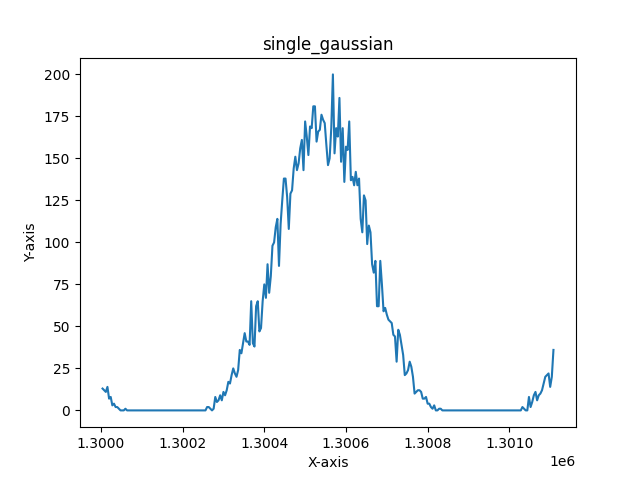
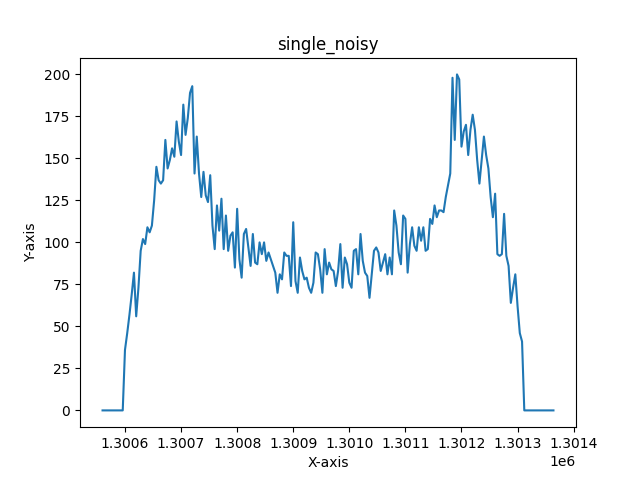
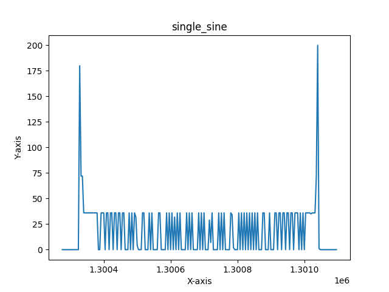
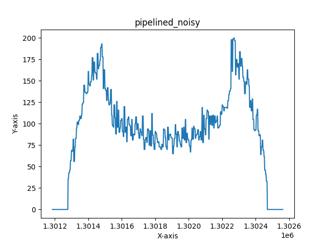
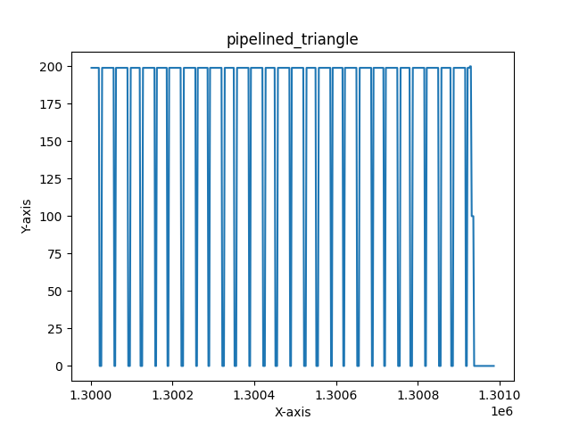
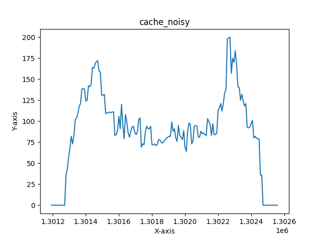
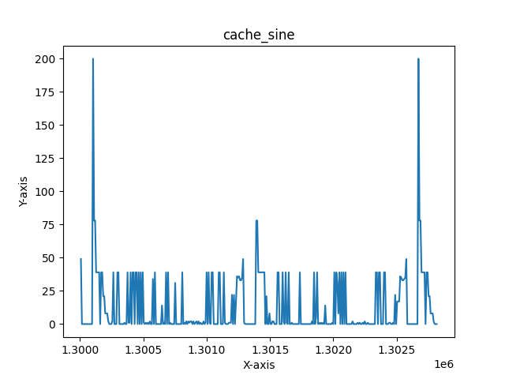

# Test
This folder contains the F1 program we used. It also has both instructions and results of the reference program and F1 program running on all 3 versions of our processor.

## Contents
1. [Test Instructions](#test-instructions-all-versions)
    - [Single Cycle](#single-cycle)
    - [Pipelined](#pipelined)
    - [Pipelined with Data Cache](#pipelined-with-data-cache)
2. [Test Results](#test-results-all-versions)
    - [Single Cycle](#single-cycle-1)
    - [Pipelined](#pipelined-1)
    - [Pipelined with Data Cache](#pipelined-with-data-cache-1)

## Test Instructions (All Versions)
### Single Cycle
#### Testing the Formula 1 Program
1. Set up a connection to Vbuddy.
2. `cd` into the `single_cycle` directory
3. Open the directory in VSCode - this is to edit the code so that correct instructions are run.
4. In `instruction_memory.sv` (located in the control folder) edit line 13 to the following:
```verilog
    $readmemh("f1.mem", instr_array);
```

5. In `data_memory.sv` (located in the data folder) comment out line 24 (we do not need to read anything into data memory for the F1 program):
```verilog
    //$readmemh("gaussian.mem", data_array, 17'h10000);
```

> [!NOTE]
> The commented out code has `gaussian.mem` in it - ignore this, this could have been any .mem file, for the sake of the F1 program, we don't care.

6. In the top level test bench file (`toplevel_tb.cpp`) comment out the code for the reference program and make sure that the code for the F1 program is uncommented:
```cpp
        // reference program
        // if (simcyc > 1300000 && simcyc % 2 == 0)
        // {  
        //     vbdPlot(int(top->a0), 0, 255);
        //     vbdCycle(simcyc);
        // }
        // end of reference program
        

        // F1 program:
        vbdCycle(simcyc);
        top->trigger_val = vbdFlag(); 
        vbdBar(top->a0 & 0xFF);
        vbdHex(3,(int(top->a0)>>8)&0xF);
        vbdHex(2,(int(top->a0)>>4)&0xF);
        vbdHex(1,int(top->a0)&0xF);
        // End of F1 program
```

7. In the Ubuntu 22.04.3 LTS terminal run the following command, having ensure that you have `cd`'d into the `single_cycle` directory
```bash
source ./single.sh
```
8. When the program has loaded onto the Vbuddy, you can start the program by pressing the trigger (rotary encoder). The F1 lights turn off after a "random" delay, the delay is determined by the value of the rotary encoder and an LFSR. To ensure this works, make sure that the rotary encoder is not at 0 when pressing the trigger.

9. We also included a small way of measuring reaction time, whilst this is definitely not accurate, in terms of measuring reaction time in seconds, it does provide a representation of reaction time. When lights go out, press the trigger again to record your reaction time. You will see your reaction time "score" outputted on both the display and the led bar.

> [!NOTE]
> Right now, we are aware that the trigger is a bit "glitchy" when recording reaction times, this is something that we would definitely get to the bottom to given more time

#### Testing the reference program
1. Set up a connection to Vbuddy.
2. `cd` into the `single_cycle` directory
3. Open the directory in VSCode - this is to edit the code so that correct instructions are run.
4. In `instruction_memory.sv` (located in the control folder) edit line 13 to the following:
```verilog
    $readmemh("pdf.mem", instr_array);
```

5. In `data_memory.sv` (located in the data folder), make sure line 24 is uncommented and add the memory file for the desired probability distribution function e.g:
```verilog
    $readmemh("gaussian.mem", data_array, 17'h10000);
```

6. In the top level test bench file (`toplevel_tb.cpp`) comment out the code for the F1 program and make sure that the code for the reference program is uncommented:
```cpp
        // reference program
        if (simcyc > 1300000 && simcyc % 2 == 0)
        {  
            vbdPlot(int(top->a0), 0, 255);
            vbdCycle(simcyc);
        }
        // end of reference program
        

        // F1 program:
        // vbdCycle(simcyc);
        // top->trigger_val = vbdFlag(); 
        // vbdBar(top->a0 & 0xFF);
        // vbdHex(3,(int(top->a0)>>8)&0xF);
        // vbdHex(2,(int(top->a0)>>4)&0xF);
        // vbdHex(1,int(top->a0)&0xF);
        // End of F1 program
```

7. In the Ubuntu 22.04.3 LTS terminal run the following command, having ensure that you have `cd`'d into the `single_cycle` directory
```bash
source ./single.sh
```

8. The program will run automatically. Wait for a couple of seconds while the distribution is being built, then the display will plot the pdf. You should see pdfs that resemble that of those in the test results.

> [!NOTE]
> The testbench has lines to write output data to a csv file. If you want to do this, ensure that all lines related to csv file generation are uncommented.

### Pipelined
#### Testing the Formula 1 Program
1. Set up a connection to Vbuddy.
2. `cd` into the `pipelined` directory
3. Open the directory in VSCode - this is to edit the code so that correct instructions are run.
4. In `instruction_memory.sv` (located in the control folder) edit line 13 to the following:
```verilog
    $readmemh("f1.mem", instr_array);
```

5. In `data_memory.sv` (located in the data folder) comment out line 26 (we do not need to read anything into data memory for the F1 program):
```verilog
    //$readmemh("gaussian.mem", data_array, 17'h10000);
```

> [!NOTE]
> The commented out code has `gaussian.mem` in it - ignore this, this could have been any .mem file, for the sake of the F1 program, we don't care.

6. In the top level test bench file (`toplevel_tb.cpp`) comment out the code for the reference program and make sure that the code for the F1 program is uncommented:
```cpp
        // reference program
        // if (simcyc > 1300000 && simcyc % 2 == 0)
        // {  
        //     vbdPlot(int(top->a0), 0, 255);
        //     vbdCycle(simcyc);
        // }
        // end of reference program
        

        // F1 program:
        vbdCycle(simcyc);
        top->trigger_val = vbdFlag(); 
        vbdBar(top->a0 & 0xFF);
        vbdHex(3,(int(top->a0)>>8)&0xF);
        vbdHex(2,(int(top->a0)>>4)&0xF);
        vbdHex(1,int(top->a0)&0xF);
        // End of F1 program
```

7. In the Ubuntu 22.04.3 LTS terminal run the following command, having ensure that you have `cd`'d into the `pipelined` directory
```bash
source ./pipelined.sh
```
8. When the program has loaded onto the Vbuddy, you can start the program by pressing the trigger (rotary encoder). The F1 lights turn off after a "random" delay, the delay is determined by the value of the rotary encoder and an LFSR. To ensure this works, make sure that the rotary encoder is not at 0 when pressing the trigger.

9. We also included a small way of measuring reaction time, whilst this is definitely not accurate, in terms of measuring reaction time in seconds, it does provide a representation of reaction time. When lights go out, press the trigger again to record your reaction time. You will see your reaction time "score" outputted on both the display and the led bar.

> [!NOTE]
> Right now, we are aware that the trigger is a bit "glitchy" when recording reaction times, this is something that we would definitely get to the bottom to given more time

#### Testing the reference program
1. Set up a connection to Vbuddy.
2. `cd` into the `pipelined` directory
3. Open the directory in VSCode - this is to edit the code so that correct instructions are run.
4. In `instruction_memory.sv` (located in the control folder) edit line 13 to the following:
```verilog
    $readmemh("pdf.mem", instr_array);
```

5. In `data_memory.sv` (located in the data folder), make sure line 26 is uncommented and add the memory file for the desired probability distribution function e.g:
```verilog
    $readmemh("gaussian.mem", data_array, 17'h10000);
```

6. In the top level test bench file (`toplevel_tb.cpp`) comment out the code for the F1 program and make sure that the code for the reference program is uncommented:
```cpp
        // reference program
        if (simcyc > 1300000 && simcyc % 2 == 0)
        {  
            vbdPlot(int(top->a0), 0, 255);
            vbdCycle(simcyc);
        }
        // end of reference program
        

        // F1 program:
        // vbdCycle(simcyc);
        // top->trigger_val = vbdFlag(); 
        // vbdBar(top->a0 & 0xFF);
        // vbdHex(3,(int(top->a0)>>8)&0xF);
        // vbdHex(2,(int(top->a0)>>4)&0xF);
        // vbdHex(1,int(top->a0)&0xF);
        // End of F1 program
```

7. In the Ubuntu 22.04.3 LTS terminal run the following command, having ensure that you have `cd`'d into the `pipelined` directory
```bash
source ./pipelined.sh
```

8. The program will run automatically. Wait for a couple of seconds while the distribution is being built, then the display will plot the pdf. You should see pdfs that resemble that of those in the test results.
> [!NOTE]
> The testbench has lines to write output data to a csv file. If you want to do this, ensure that all lines related to csv file generation are uncommented.

### Pipelined with Data Cache
#### Testing the Formula 1 Program
1. Set up a connection to Vbuddy.
2. `cd` into the `cache` directory
3. Open the directory in VSCode - this is to edit the code so that correct instructions are run.
4. In `instruction_memory.sv` (located in the control folder) edit line 13 to the following:
```verilog
    $readmemh("f1.mem", instr_array);
```

5. In `data_memory.sv` (located in the data folder) comment out line 27 (we do not need to read anything into data memory for the F1 program):
```verilog
    //$readmemh("gaussian.mem", data_array, 17'h10000);
```

> [!NOTE]
> The commented out code has `gaussian.mem` in it - ignore this, this could have been any .mem file, for the sake of the F1 program, we don't care.

6. In the top level test bench file (`toplevel_tb.cpp`) comment out the code for the reference program and make sure that the code for the F1 program is uncommented:
```cpp
        // reference program
        // if (simcyc > 1300000 && simcyc % 2 == 0)
        // {  
        //     vbdPlot(int(top->a0), 0, 255);
        //     vbdCycle(simcyc);
        // }
        // end of reference program
        

        // F1 program:
        vbdCycle(simcyc);
        top->trigger_val = vbdFlag(); 
        vbdBar(top->a0 & 0xFF);
        vbdHex(3,(int(top->a0)>>8)&0xF);
        vbdHex(2,(int(top->a0)>>4)&0xF);
        vbdHex(1,int(top->a0)&0xF);
        // End of F1 program
```

7. In the Ubuntu 22.04.3 LTS terminal run the following command, having ensure that you have `cd`'d into the `cache` directory
```bash
source ./cache.sh
```
8. When the program has loaded onto the Vbuddy, you can start the program by pressing the trigger (rotary encoder). The F1 lights turn off after a "random" delay, the delay is determined by the value of the rotary encoder and an LFSR. To ensure this works, make sure that the rotary encoder is not at 0 when pressing the trigger.

9. We also included a small way of measuring reaction time, whilst this is definitely not accurate, in terms of measuring reaction time in seconds, it does provide a representation of reaction time. When lights go out, press the trigger again to record your reaction time. You will see your reaction time "score" outputted on both the display and the led bar.

> [!NOTE]
> Right now, we are aware that the trigger is a bit "glitchy" when recording reaction times, this is something that we would definitely get to the bottom to given more time

#### Testing the reference program
1. Set up a connection to Vbuddy.
2. `cd` into the `cache` directory
3. Open the directory in VSCode - this is to edit the code so that correct instructions are run.
4. In `instruction_memory.sv` (located in the control folder) edit line 13 to the following:
```verilog
    $readmemh("pdf.mem", instr_array);
```

5. In `data_memory.sv` (located in the data folder), make sure line 27 is uncommented and add the memory file for the desired probability distribution function e.g:
```verilog
    $readmemh("gaussian.mem", data_array, 17'h10000);
```

6. In the top level test bench file (`toplevel_tb.cpp`) comment out the code for the F1 program and make sure that the code for the reference program is uncommented:
```cpp
        // reference program
        if (simcyc > 1300000 && simcyc % 2 == 0)
        {  
            vbdPlot(int(top->a0), 0, 255);
            vbdCycle(simcyc);
        }
        // end of reference program
        

        // F1 program:
        // vbdCycle(simcyc);
        // top->trigger_val = vbdFlag(); 
        // vbdBar(top->a0 & 0xFF);
        // vbdHex(3,(int(top->a0)>>8)&0xF);
        // vbdHex(2,(int(top->a0)>>4)&0xF);
        // vbdHex(1,int(top->a0)&0xF);
        // End of F1 program
```

7. In the Ubuntu 22.04.3 LTS terminal run the following command, having ensure that you have `cd`'d into the `cache` directory
```bash
source ./cache.sh
```

8. The program will run automatically. Wait for a couple of seconds while the distribution is being built, then the display will plot the pdf. You should see pdfs that resemble that of those in the test results.
> [!NOTE]
> The testbench has lines to write output data to a csv file. If you want to do this, ensure that all lines related to csv file generation are uncommented.

## Test Results (All Versions)
### Single Cycle
#### F1 Program


https://github.com/Nimosteve88/Team-3-RISCV-RV32I_Processor_Project/assets/66144849/293393be-d84b-4561-9a0e-836e20b4378a


#### Reference Program
Videos for the reference program can be seen below


https://github.com/Nimosteve88/Team-3-RISCV-RV32I_Processor_Project/assets/66144849/e2467acb-1db6-473e-b374-a0244b811c4e


https://github.com/Nimosteve88/Team-3-RISCV-RV32I_Processor_Project/assets/66144849/43d47c97-a094-42e9-8363-1cf7bca31c15


https://github.com/Nimosteve88/Team-3-RISCV-RV32I_Processor_Project/assets/66144849/0994fbe8-5a79-4fb0-af32-36b7b1925aa2


https://github.com/Nimosteve88/Team-3-RISCV-RV32I_Processor_Project/assets/66144849/232581d0-de47-4ffb-ac0e-3463a5412a0b


Additionally, CSV files with output data were generated for each distribution in the test bench. These were plotted and are as follows:

|  |        |
|---------------------------------------------------------------|---------------------------------------------------------------|
|          |  |

### Pipelined
#### F1 Program


https://github.com/Nimosteve88/Team-3-RISCV-RV32I_Processor_Project/assets/66144849/ccbf32fb-779d-41bf-9a27-0daa49e167ec


#### Reference Program
Videos for the reference program can be seen below


https://github.com/Nimosteve88/Team-3-RISCV-RV32I_Processor_Project/assets/66144849/6d27a1ff-dbbd-4057-b045-dbaf9a0921a7


https://github.com/Nimosteve88/Team-3-RISCV-RV32I_Processor_Project/assets/66144849/767919f9-fd3d-4d24-a247-6c8cb1e3701d


https://github.com/Nimosteve88/Team-3-RISCV-RV32I_Processor_Project/assets/66144849/5ebd6de4-3a6f-4b45-9f79-3bfad54c9593


https://github.com/Nimosteve88/Team-3-RISCV-RV32I_Processor_Project/assets/66144849/1b12e36c-ef37-4aaa-84d2-a581ba95558c


Additionally, CSV files with output data were generated for each distribution in the test bench. These were plotted and are as follows:

|  |        |
|---------------------------------------------------------------|---------------------------------------------------------------|
|          |  |

### Pipelined with Data Cache
#### F1 Program


https://github.com/Nimosteve88/Team-3-RISCV-RV32I_Processor_Project/assets/66144849/1bf462ce-06b5-4977-a8c1-ca968515cd1a


#### Reference Program
Videos for the reference program can be seen below


https://github.com/Nimosteve88/Team-3-RISCV-RV32I_Processor_Project/assets/66144849/30ecfb66-f433-4fa4-b926-8af3bbeb847a


https://github.com/Nimosteve88/Team-3-RISCV-RV32I_Processor_Project/assets/66144849/e4dc5dec-d71e-4457-89c3-3c398cdae1ab


https://github.com/Nimosteve88/Team-3-RISCV-RV32I_Processor_Project/assets/66144849/2faa7620-09f6-4d2d-badd-5dd27e1930f5


https://github.com/Nimosteve88/Team-3-RISCV-RV32I_Processor_Project/assets/66144849/9b7ac157-afe3-494b-8257-420d18eff83f


Additionally, CSV files with output data were generated for each distribution in the test bench. These were plotted and are as follows:

|  |        |
|---------------------------------------------------------------|---------------------------------------------------------------|
|          |  |

> [!NOTE]
> It is important to point out that for cache results, the pdf results appear to be slightly smoother. This is because the output results were taken less frequently for a given cycle of the pdf generation - this can be seen in the test bench.
